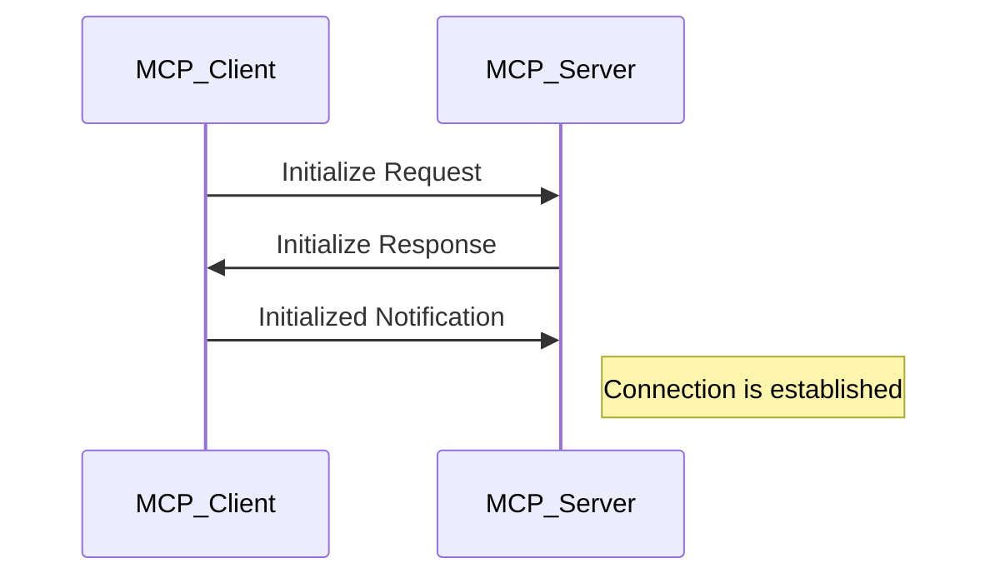
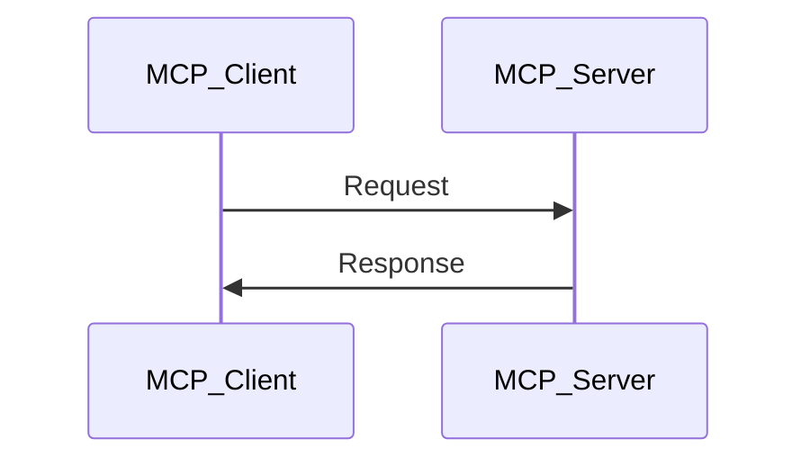
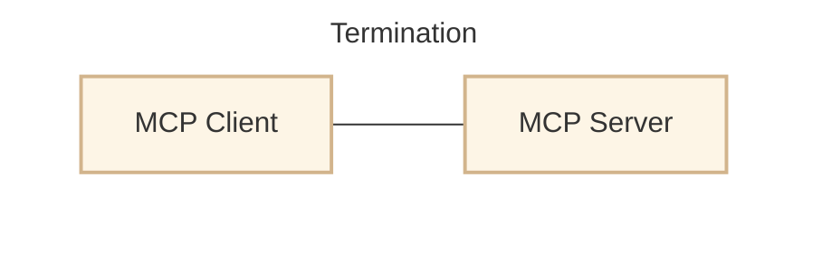
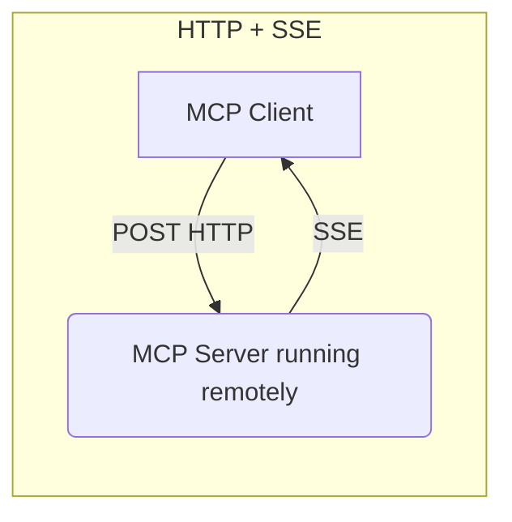
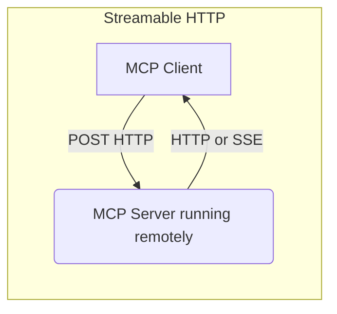

# M
Note: deeplearning.ai

Key Message： “Models are only as good as the **context** given to them."

Everything you are going to see with MCP can be done without MCP.

### “什么是模型上下文协议 (MCP)”
它通过与其他两种协议进行对比，解释了 MCP 的作用和定位：

1.  **REST APIs (红色方框)：** 它们标准化了 **Web 应用程序** 如何与 **后端** 进行交互。
2.  **LSP (Language Server Protocol) (蓝色方框)：** 它标准化了 **IDE** 如何与 **特定语言工具** 进行交互。
3.  **MCP (Model Context Protocol) (橙色方框)：** 它标准化了 **AI 应用程序** 如何与 **外部系统** 进行交互。

**总结来说，MCP 是一种开放协议，旨在标准化 LLM (大型语言模型) 应用程序如何连接和使用你的工具和数据源。它将 MCP 定位为 AI 应用领域中类似于 REST APIs (Web 应用) 和 LSP (IDE) 的一个标准化协议。**

这张图解释了 **Model Context Protocol (MCP)** 的工作原理，它主要围绕着 **MCP 客户端** 和 **MCP 服务器** 之间的交互，以及它们处理的三种核心实体：**工具 (Tools)**、**资源 (Resources)** 和 **提示模板 (Prompt Templates)**。

### MCP 工作流概述

MCP 客户端和 MCP 服务器之间的双向通信：

* **MCP 客户端：**
    * **调用工具 (Invokes Tools):** 客户端可以请求服务器执行特定的工具或功能。
    * **查询资源 (Queries for Resources):** 客户端可以向服务器请求访问数据或信息。
    * **插值提示 (Interpolates Prompts):** 客户端可以根据预定义的模板和上下文生成具体的提示（通常用于 AI 模型的输入）。

* **MCP 服务器：**
    * **暴露工具 (Exposes Tools):** 服务器提供可以被客户端调用的各种功能。
    * **暴露资源 (Exposes Resources):** 服务器提供客户端可以访问的各种数据。
    * **暴露提示模板 (Exposes Prompt Templates):** 服务器提供预定义的结构化模板，供客户端用来构建 AI 交互的提示。

### 核心实体详解

图的下半部分详细解释了 MCP 中涉及的三种关键实体：

1.  **工具 (Tools)**
    * **定义：** 客户端可以调用的功能和工具。这些是可执行的操作。
    * **示例：**
        * `Retrieve / search`：检索或搜索信息的功能。
        * `Send a message`：发送消息的功能（例如通过通信系统）。
        * `Update DB records`：更新数据库记录的功能。
    * **作用：** 允许 AI 应用程序执行外部操作，例如查询数据库、发送通知或与其他服务交互。

2.  **资源 (Resources)**
    * **定义：** 服务器暴露的只读数据。这些是信息载体。
    * **示例：**
        * `Files`：文件内容。
        * `Database Records`：数据库中的特定记录。
        * `API Responses`：来自其他 API 调用的响应数据。
    * **作用：** 为 AI 应用程序提供上下文数据，LLM 可以从中获取信息或用于生成响应。

3.  **提示模板 (Prompt Templates)**
    * **定义：** 用于 AI 交互的预定义模板。这些是结构化生成 AI 输入的方式。
    * **示例：**
        * `Document Q&A`：用于问答任务的模板，可能包含文档内容和问题占位符。
        * `Transcript Summary`：用于总结转录文本的模板。
        * `Output as JSON`：要求 AI 输出特定 JSON 格式的模板。
    * **作用：** 帮助 AI 应用程序以一致和结构化的方式构建发送给大型语言模型 (LLM) 的提示，以确保 LLM 能够理解意图并产生期望格式的输出。

好的，这张图描述了 **MCP (Model Context Protocol)** 的**通信生命周期**，分为三个阶段：**初始化 (Initialization)**、**消息交换 (Message Exchange)** 和 **终止 (Termination)**。

我将使用 Mermaid 序列图来表示每个阶段。

-----

### 1\. 初始化 (Initialization)

这个阶段建立了客户端和服务器之间的连接。

### 2\. 消息交换 (Message Exchange)

在连接建立后，客户端和服务器可以进行请求-响应的消息交换。

### 3\. 终止 (Termination)

这个阶段表示通信的结束，客户端和服务器之间的连接断开。图中只简单表示了两者独立存在，意味着通信会话的结束。

-----

**解释：**

  * **初始化阶段**：客户端发起一个 `Initialize Request`，服务器响应 `Initialize Response`，然后客户端发送 `Initialized Notification`，表明连接已经成功建立。
  * **消息交换阶段**：一旦连接建立，客户端可以发送 `Request`，服务器会返回 `Response`， 或者相反， 或者互发`notification`。这代表了 MCP 客户端调用工具、查询资源或发送提示的正常交互流程。
  * **终止阶段**：图示并未显示具体的终止消息流程（例如断开连接请求），而是通过将 MCP 客户端和 MCP 服务器显示为独立的实体来暗示通信的结束。在实际应用中，终止可能通过客户端或服务器发送关闭连接的信号来实现，或者由于超时等原因自动断开。

这是一张关于 **MCP (Model Context Protocol) 传输方式 (Transports)** 的说明图，将其内容翻译并整理成中文笔记如下：

---

### **MCP 传输方式**

传输方式负责处理客户端和服务器之间消息发送和接收的底层机制。

1.  **对于本地运行的服务器：**
    * **stdio (标准输入输出)：** 适用于客户端和服务器在同一台机器上运行，通过标准输入输出流进行通信的场景。

2.  **对于远程服务器：**
    * **HTTP+SSE (Server Sent Events - 服务器发送事件)：**
        * 从协议版本 **2024-11-05** 开始支持。
        * 适用于服务器需要向客户端推送实时更新或流式数据的场景。
    * **Streamable HTTP (可流式传输的 HTTP)：**
        * 从协议版本 **2025-03-26** 开始支持。
        * 这是一种允许在单个 HTTP 连接上进行双向流式通信的机制，通常用于更灵活和高性能的远程通信。

---

好的，这张图对比了两种用于 MCP 远程服务器的传输方式：**HTTP + SSE** 和 **Streamable HTTP**。

我将用 Mermaid 流程图和序列图来表示这些概念，并提供解释。

-----

### 1\. HTTP + SSE (Server Sent Events)

**Mermaid 图：**

**解释：**

  * **特点：** HTTP + SSE 是一种有状态 (Stateful) 的连接。
  * **工作原理：**
      * **客户端向服务器发送请求：** MCP 客户端通过标准的 **POST HTTP** 请求向远程运行的 MCP 服务器发送数据或指令。
      * **服务器向客户端推送事件：** 服务器使用 **SSE (Server Sent Events)** 技术向客户端推送数据。SSE 允许服务器在单个 HTTP 连接上持续地向客户端发送事件流，而无需客户端反复发起请求。
  * **适用场景：** 通常用于服务器需要主动向客户端推送数据更新（例如日志、进度、实时通知）的场景，是一种单向（服务器到客户端）的流式通信。
  * **协议版本：** 从协议版本 2024-11-05 开始支持。

-----

### 2\. Streamable HTTP

**Mermaid 图：**

**解释：**

  * **特点：** Streamable HTTP 允许**无状态 (Stateless)** 或**有状态 (Stateful)** 连接。这是一个更灵活的传输机制。
  * **工作原理：**
      * **客户端向服务器发送请求：** MCP 客户端通过 **POST HTTP** 请求向远程运行的 MCP 服务器发送数据。
      * **服务器向客户端响应/推送：** 服务器可以回复标准的 HTTP 响应，也可以使用 SSE 方式向客户端推送数据。这里的关键在于“Streamable”，意味着它支持在单个 HTTP 连接上进行双向的流式数据传输，这比传统的 HTTP 请求-响应模式更高效和灵活。它可能利用了像 HTTP/2 Streaming 或 WebSockets 类似的底层机制来提供这种能力，尽管图中标注的是“HTTP or SSE”，暗示其包含了 SSE 的能力，但更强调其整体的双向流能力。
  * **适用场景：** 适用于需要更高灵活性和性能的远程通信场景，既可以处理简单的无状态请求，也可以维持有状态的流式通信。
  * **协议版本：** 从协议版本 2025-03-05 开始支持。

-----

### 总结比较

  * **HTTP + SSE：** 主要特点是服务器向客户端的单向流式推送（SSE），并且连接是有状态的。更侧重于服务器的推送能力。
  * **Streamable HTTP：** 提供更高级的流式传输能力，支持双向通信，并且更灵活，可以适应无状态或有状态的连接。这是一个更现代和强大的远程通信方式。

两种传输方式都基于 HTTP 协议，但通过不同的技术（SSE 或更广义的 Streamable HTTP）来增强远程通信的能力，以适应 MCP 客户端和服务器之间复杂的消息交换需求。

**如何创建 MCP 服务器？**

一个暴露工具的 MCP 服务器需要处理客户端的两个主要请求：
1.  **列出所有工具 (listing all the tools)**
2.  **执行特定工具 (executing a particular tool)**

创建 MCP 服务器有两种主要方式：

1.  **低级实现 (low-level implementation):**
    * **方式：** 直接定义和处理各种类型的请求，例如 `ListToolsRequest` 和 `CallToolRequest`。
    * **优点：** 允许你自定义服务器的每一个方面。
    * **适用场景：** 需要高度定制化和精细控制的场景。
example： https://github.com/modelcontextprotocol/python-sdk/blob/main/examples/servers/simple-tool/mcp_simple_tool/server.py

2.  **高级实现 - 使用 FastMCP (high-level implementation using FastMCP):**
    * **方式：** `FastMCP` 是一个高级接口，旨在更快、更简单地构建 MCP 服务器。
    * **优点：** 你只需专注于将工具定义为函数，`FastMCP` 会处理所有协议细节。
    * **适用场景：** 追求开发效率和简化复杂性的场景。
