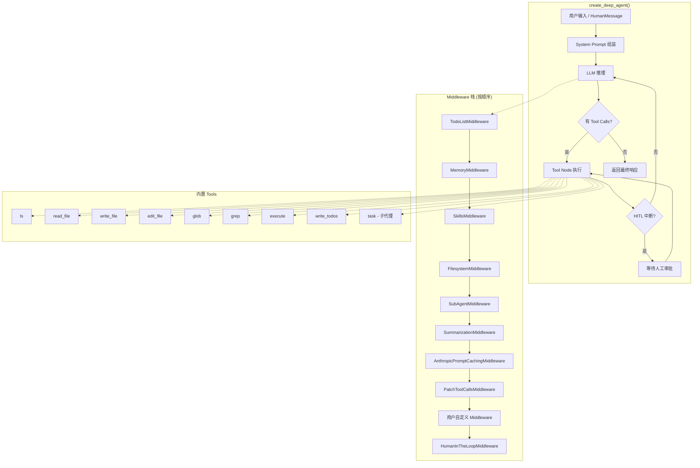
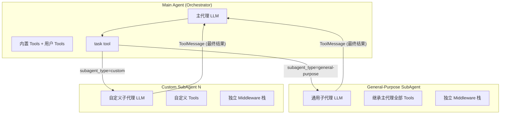
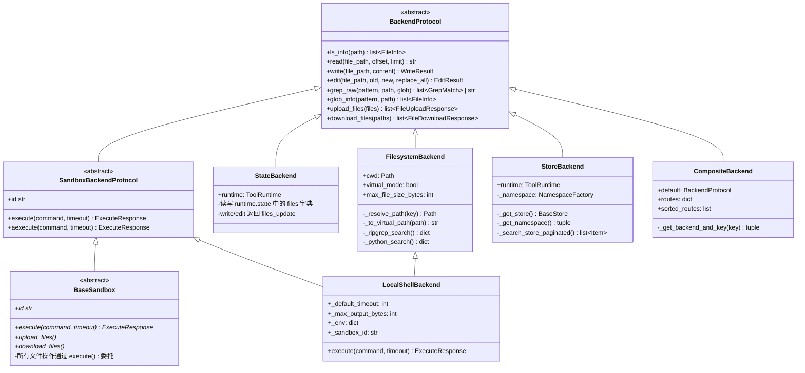
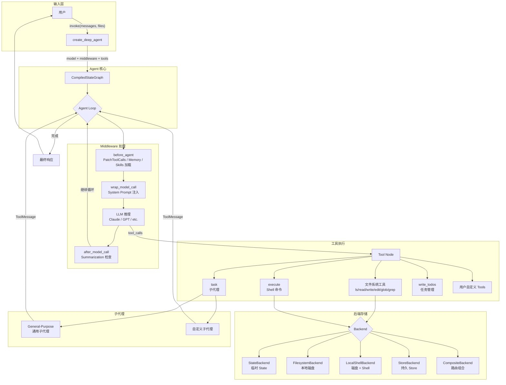

# Deep Agents 架构全景

## LangGraph 图结构

Deep Agents 的核心是通过 `create_deep_agent()` 函数构建一个 LangGraph `CompiledStateGraph`。底层调用 `langchain.agents.create_agent()` 创建一个 tool-calling agent loop。



## 主代理 + 子代理架构



---

## Backends (后端存储层)

Backend 是 Deep Agents 的文件存储抽象层。所有后端实现 `BackendProtocol` 接口，提供统一的文件操作 API，使上层 Middleware 和 Tools 无需关心底层存储细节。

| Backend | 类名 | 存储位置 | 持久性 | 执行能力 | 典型场景 |
| --- | --- | --- | --- | --- | --- |
| State | `StateBackend` | LangGraph agent state | 会话内临时 | ❌ | 默认后端，轻量临时文件 |
| Filesystem | `FilesystemBackend` | 本地磁盘 | 永久 | ❌ | 本地开发 CLI |
| LocalShell | `LocalShellBackend` | 本地磁盘 + Shell | 永久 | ✅ `execute()` | 本地开发 + 命令执行 |
| Store | `StoreBackend` | LangGraph BaseStore | 跨会话持久 | ❌ | 持久化记忆/文件 |
| Sandbox | `BaseSandbox` (抽象) | 远程沙箱环境 | 取决于实现 | ✅ `execute()` | Docker/VM 隔离执行 |
| Composite | `CompositeBackend` | 路由到多个后端 | 取决于子后端 | 取决于 default | 混合存储策略 |

### 类继承关系



注意 `LocalShellBackend` 是双重继承：它同时继承 `FilesystemBackend`（文件操作）和 `SandboxBackendProtocol`（Shell 执行能力）。

### BackendProtocol 核心接口

`BackendProtocol` 是所有后端的基类 (ABC)，定义了统一的文件操作接口。每个方法都有对应的 async 版本 (`als_info`, `aread`, `awrite` 等)，默认通过 `asyncio.to_thread()` 委托到同步实现。

```python
# 核心文件操作接口
ls_info(path: str) -> list[FileInfo]                          # 列出目录 (非递归)
read(file_path: str, offset=0, limit=2000) -> str             # 读取文件 (带行号, cat -n 格式)
write(file_path: str, content: str) -> WriteResult            # 创建新文件 (已存在则报错)
edit(file_path: str, old: str, new: str, replace_all=False) -> EditResult  # 精确字符串替换
grep_raw(pattern: str, path=None, glob=None) -> list[GrepMatch] | str     # 文本搜索 (literal, 非 regex)
glob_info(pattern: str, path="/") -> list[FileInfo]           # Glob 模式文件搜索
upload_files(files: list[tuple[str, bytes]]) -> list[FileUploadResponse]   # 批量上传
download_files(paths: list[str]) -> list[FileDownloadResponse]             # 批量下载
```

---

## Middleware (中间件层)

中间件在 agent loop 的不同阶段注入逻辑，按栈顺序执行。

| Middleware | 类名 | 功能 | 注入的 Tools | 修改 System Prompt |
|-----------|------|------|-------------|-------------------|
| TodoList | `TodoListMiddleware` | 任务规划与跟踪 | `write_todos` | ✅ |
| Memory | `MemoryMiddleware` | 加载 AGENTS.md 记忆文件 | 无 (复用 edit_file) | ✅ 注入记忆内容 |
| Skills | `SkillsMiddleware` | 加载 SKILL.md 技能库 | 无 (复用 read_file) | ✅ 注入技能列表 |
| Filesystem | `FilesystemMiddleware` | 文件系统操作 | `ls` `read_file` `write_file` `edit_file` `glob` `grep` `execute` | ✅ |
| SubAgent | `SubAgentMiddleware` | 子代理调度 | `task` | ✅ |
| Summarization | `SummarizationMiddleware` | 对话历史摘要 + 卸载 | 无 | ✅ (摘要注入) |
| AnthropicPromptCaching | `AnthropicPromptCachingMiddleware` | Anthropic 模型 prompt 缓存优化 | 无 | 否 |
| PatchToolCalls | `PatchToolCallsMiddleware` | 修补悬空的 tool calls | 无 | 否 |
| HumanInTheLoop | `HumanInTheLoopMiddleware` | 人工审批中断 | 无 | 否 |

---

## Tools 总览

| Tool | 来源 | 描述 |
|------|------|------|
| `ls` | FilesystemMiddleware | 列出目录内容 |
| `read_file` | FilesystemMiddleware | 读取文件 (支持分页、图片) |
| `write_file` | FilesystemMiddleware | 创建新文件 |
| `edit_file` | FilesystemMiddleware | 精确字符串替换编辑 |
| `glob` | FilesystemMiddleware | Glob 模式文件搜索 |
| `grep` | FilesystemMiddleware | 文本内容搜索 (literal, 非 regex) |
| `execute` | FilesystemMiddleware | Shell 命令执行 (需 SandboxBackend) |
| `write_todos` | TodoListMiddleware | 管理任务列表 |
| `task` | SubAgentMiddleware | 启动子代理执行隔离任务 |

---

## 完整数据流



---

**本系列文章：**
- [Deep Agents 架构全景](/blog/2026/02/26/deepagents-architecture/)（本文）
- [Deep Agents Human-in-the-Loop 机制详解](/blog/2026/02/26/deepagents-hitl/)
- [Deep Agents Memory 机制详解](/blog/2026/02/26/deepagents-memory/)
- [Deep Agents General-Purpose SubAgent 详解](/blog/2026/02/26/deepagents-subagent/)
