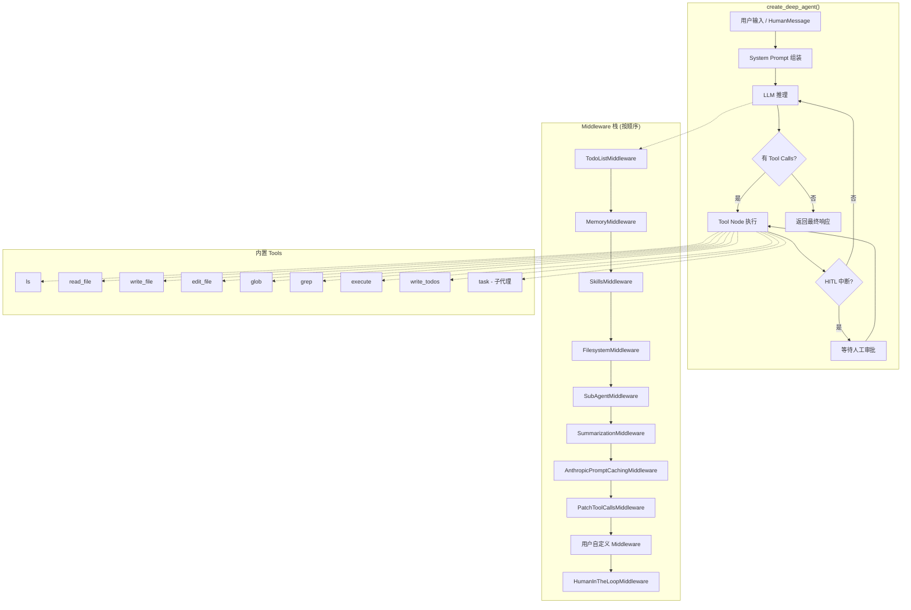
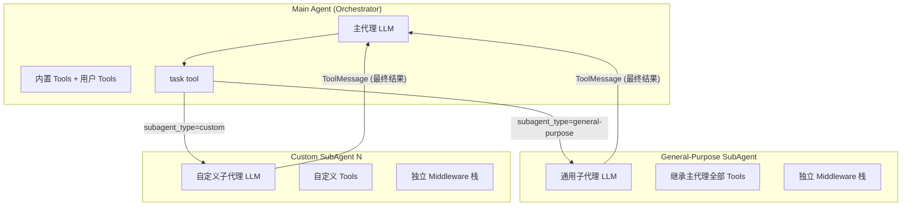
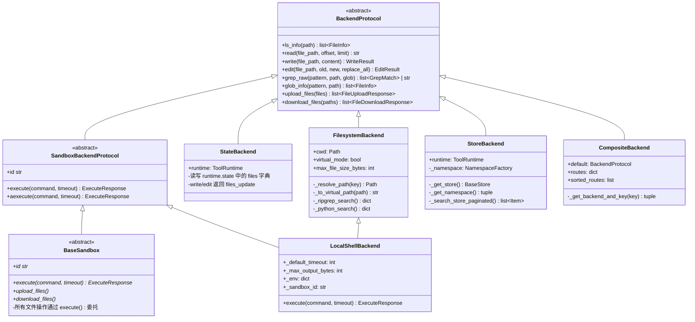
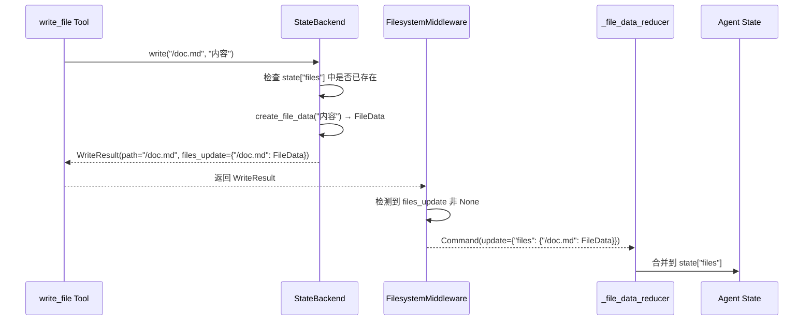
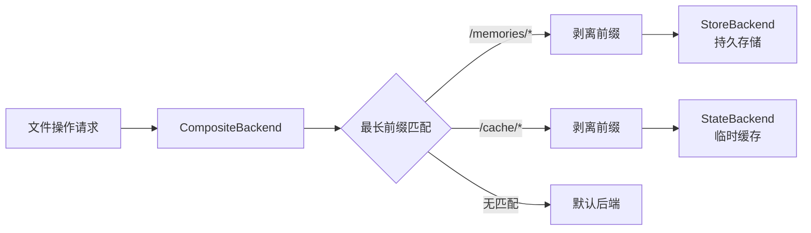
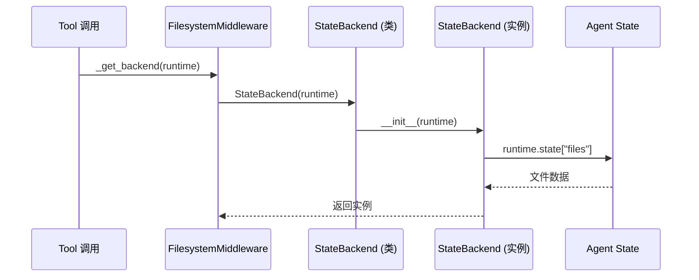
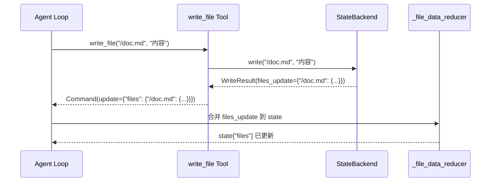
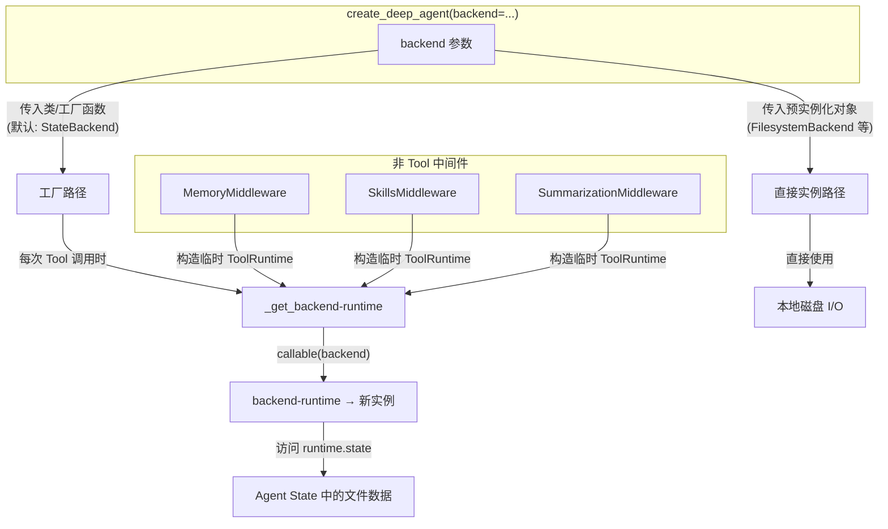
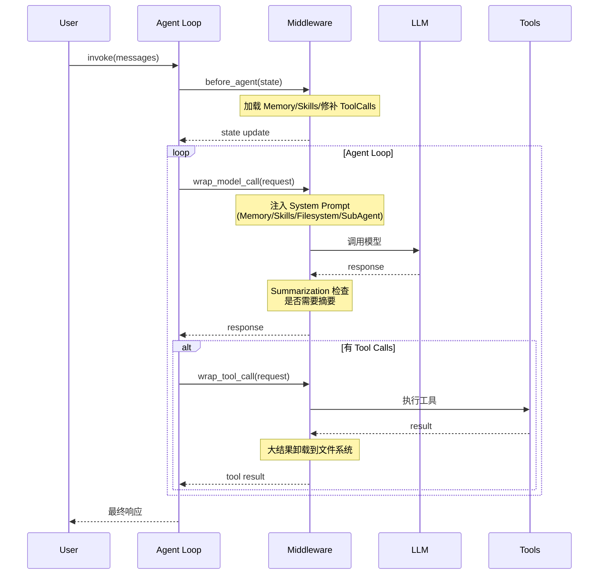
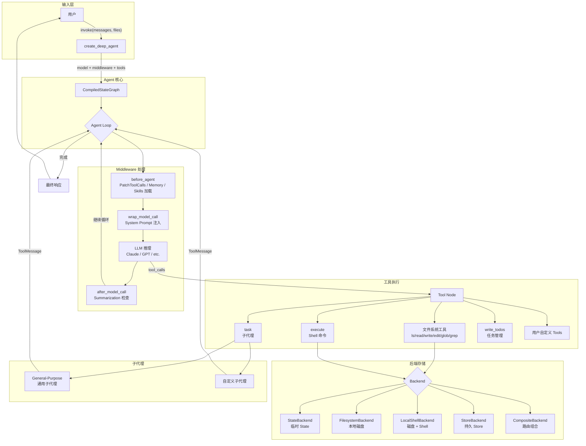

## LangGraph 图结构

Deep Agents 的核心是通过 `create_deep_agent()` 函数构建一个 LangGraph `CompiledStateGraph`。底层调用 `langchain.agents.create_agent()` 创建一个 tool-calling agent loop。


```mermaid
graph TD
    subgraph "create_deep_agent()"
        A[用户输入 / HumanMessage] --> B[System Prompt 组装]
        B --> C[LLM 推理]
        C --> D{有 Tool Calls?}
        D -- 是 --> E[Tool Node 执行]
        E --> F{HITL 中断?}
        F -- 否 --> C
        F -- 是 --> G[等待人工审批]
        G --> E
        D -- 否 --> H[返回最终响应]
    end

    subgraph "Middleware 栈 (按顺序)"
        M1[TodoListMiddleware] --> M2[MemoryMiddleware]
        M2 --> M3[SkillsMiddleware]
        M3 --> M4[FilesystemMiddleware]
        M4 --> M5[SubAgentMiddleware]
        M5 --> M6[SummarizationMiddleware]
        M6 --> M7[AnthropicPromptCachingMiddleware]
        M7 --> M8[PatchToolCallsMiddleware]
        M8 --> M9[用户自定义 Middleware]
        M9 --> M10[HumanInTheLoopMiddleware]
    end

    subgraph "内置 Tools"
        T1[ls]
        T2[read_file]
        T3[write_file]
        T4[edit_file]
        T5[glob]
        T6[grep]
        T7[execute]
        T8[write_todos]
        T9[task - 子代理]
    end

    C -.-> M1
    E -.-> T1 & T2 & T3 & T4 & T5 & T6 & T7 & T8 & T9
```

## 主代理 + 子代理架构


```mermaid
graph TB
    subgraph "Main Agent (Orchestrator)"
        MA[主代理 LLM]
        MA_TOOLS[内置 Tools + 用户 Tools]
        MA_TASK[task tool]
    end

    subgraph "General-Purpose SubAgent"
        GP[通用子代理 LLM]
        GP_TOOLS[继承主代理全部 Tools]
        GP_MW[独立 Middleware 栈]
    end

    subgraph "Custom SubAgent N"
        CS[自定义子代理 LLM]
        CS_TOOLS[自定义 Tools]
        CS_MW[独立 Middleware 栈]
    end

    MA --> MA_TASK
    MA_TASK -- "subagent_type=general-purpose" --> GP
    MA_TASK -- "subagent_type=custom" --> CS
    GP -- "ToolMessage (最终结果)" --> MA
    CS -- "ToolMessage (最终结果)" --> MA
```

---

## Backends (后端存储层)

Backend 是 Deep Agents 的文件存储抽象层。所有后端实现 `BackendProtocol` 接口，提供统一的文件操作 API，使上层 Middleware 和 Tools 无需关心底层存储细节。

| Backend | 类名 | 存储位置 | 持久性 | 执行能力 | 典型场景 |
| --- | --- | --- | --- | --- | --- |
| State | `StateBackend` | LangGraph agent state | 会话内临时 | ❌ | 默认后端，轻量临时文件 |
| Filesystem | `FilesystemBackend` | 本地磁盘 | 永久 | ❌ | 本地开发 CLI |
| LocalShell | `LocalShellBackend` | 本地磁盘 + Shell | 永久 | ✅ `execute()` | 本地开发 + 命令执行 |
| Store | `StoreBackend` | LangGraph BaseStore | 跨会话持久 | ❌ | 持久化记忆/文件 |
| Sandbox | `BaseSandbox` (抽象) | 远程沙箱环境 | 取决于实现 | ✅ `execute()` | Docker/VM 隔离执行 |
| Composite | `CompositeBackend` | 路由到多个后端 | 取决于子后端 | 取决于 default | 混合存储策略 |

### 类继承关系


```mermaid
classDiagram
    class BackendProtocol {
        <<abstract>>
        +ls_info(path) list~FileInfo~
        +read(file_path, offset, limit) str
        +write(file_path, content) WriteResult
        +edit(file_path, old, new, replace_all) EditResult
        +grep_raw(pattern, path, glob) list~GrepMatch~ | str
        +glob_info(pattern, path) list~FileInfo~
        +upload_files(files) list~FileUploadResponse~
        +download_files(paths) list~FileDownloadResponse~
    }

    class SandboxBackendProtocol {
        <<abstract>>
        +id str
        +execute(command, timeout) ExecuteResponse
        +aexecute(command, timeout) ExecuteResponse
    }

    class StateBackend {
        +runtime: ToolRuntime
        -读写 runtime.state 中的 files 字典
        -write/edit 返回 files_update
    }

    class FilesystemBackend {
        +cwd: Path
        +virtual_mode: bool
        +max_file_size_bytes: int
        -_resolve_path(key) Path
        -_to_virtual_path(path) str
        -_ripgrep_search() dict
        -_python_search() dict
    }

    class LocalShellBackend {
        +_default_timeout: int
        +_max_output_bytes: int
        +_env: dict
        +_sandbox_id: str
        +execute(command, timeout) ExecuteResponse
    }

    class StoreBackend {
        +runtime: ToolRuntime
        -_namespace: NamespaceFactory
        -_get_store() BaseStore
        -_get_namespace() tuple
        -_search_store_paginated() list~Item~
    }

    class BaseSandbox {
        <<abstract>>
        +execute(command, timeout) ExecuteResponse*
        +id str*
        +upload_files()*
        +download_files()*
        -所有文件操作通过 execute() 委托
    }

    class CompositeBackend {
        +default: BackendProtocol
        +routes: dict
        +sorted_routes: list
        -_get_backend_and_key(key) tuple
    }

    BackendProtocol <|-- SandboxBackendProtocol
    BackendProtocol <|-- StateBackend
    BackendProtocol <|-- FilesystemBackend
    BackendProtocol <|-- StoreBackend
    BackendProtocol <|-- CompositeBackend
    SandboxBackendProtocol <|-- BaseSandbox
    FilesystemBackend <|-- LocalShellBackend
    SandboxBackendProtocol <|-- LocalShellBackend
```

注意 `LocalShellBackend` 是双重继承：它同时继承 `FilesystemBackend`（文件操作）和 `SandboxBackendProtocol`（Shell 执行能力）。

### BackendProtocol 核心接口

`BackendProtocol` 是所有后端的基类 (ABC)，定义了统一的文件操作接口。每个方法都有对应的 async 版本 (`als_info`, `aread`, `awrite` 等)，默认通过 `asyncio.to_thread()` 委托到同步实现。

```python
# 核心文件操作接口
ls_info(path: str) -> list[FileInfo]                          # 列出目录 (非递归)
read(file_path: str, offset=0, limit=2000) -> str             # 读取文件 (带行号, cat -n 格式)
write(file_path: str, content: str) -> WriteResult            # 创建新文件 (已存在则报错)
edit(file_path: str, old: str, new: str, replace_all=False) -> EditResult  # 精确字符串替换
grep_raw(pattern: str, path=None, glob=None) -> list[GrepMatch] | str     # 文本搜索 (literal, 非 regex)
glob_info(pattern: str, path="/") -> list[FileInfo]           # Glob 模式文件搜索
upload_files(files: list[tuple[str, bytes]]) -> list[FileUploadResponse]   # 批量上传
download_files(paths: list[str]) -> list[FileDownloadResponse]             # 批量下载
```

#### 核心数据模型

文件在后端中以 `FileData` 字典格式存储：

```python
FileData = {
    "content": list[str],    # 文件内容，按行分割
    "created_at": str,       # ISO 8601 创建时间戳
    "modified_at": str,      # ISO 8601 修改时间戳
}
```

操作结果通过专用 dataclass 返回：

```python
@dataclass
class WriteResult:
    error: str | None = None           # 失败时的错误信息
    path: str | None = None            # 成功时的文件路径
    files_update: dict | None = None   # StateBackend: {path: FileData} 用于 state 更新
                                       # 外部存储后端: None (已直接持久化)

@dataclass
class EditResult:
    error: str | None = None
    path: str | None = None
    files_update: dict | None = None   # 同 WriteResult
    occurrences: int | None = None     # 替换次数

@dataclass
class ExecuteResponse:
    output: str                        # 合并的 stdout + stderr
    exit_code: int | None = None       # 进程退出码
    truncated: bool = False            # 输出是否被截断
```

辅助数据类型：

```python
class FileInfo(TypedDict):             # 文件元数据
    path: str                          # 必填: 绝对路径
    is_dir: NotRequired[bool]          # 可选: 是否为目录
    size: NotRequired[int]             # 可选: 字节大小
    modified_at: NotRequired[str]      # 可选: ISO 时间戳

class GrepMatch(TypedDict):            # 搜索匹配结果
    path: str                          # 文件路径
    line: int                          # 行号 (1-indexed)
    text: str                          # 匹配行的完整内容

# 文件传输结果 (支持批量操作中的部分成功)
@dataclass
class FileDownloadResponse:
    path: str
    content: bytes | None = None       # 成功时的文件内容
    error: FileOperationError | None = None

@dataclass
class FileUploadResponse:
    path: str
    error: FileOperationError | None = None

# 标准化错误码
FileOperationError = Literal["file_not_found", "permission_denied", "is_directory", "invalid_path"]
```

`files_update` 是区分 "checkpoint 后端" 和 "外部存储后端" 的关键字段：
- `StateBackend` 返回 `files_update = {"/path": FileData}`，由 `FilesystemMiddleware` 包装为 LangGraph `Command` 写回 state
- `FilesystemBackend`、`StoreBackend` 等外部后端返回 `files_update = None`，因为数据已直接持久化到磁盘/Store

### SandboxBackendProtocol (扩展接口)

`SandboxBackendProtocol` 继承 `BackendProtocol`，增加 Shell 命令执行能力。适用于在隔离环境 (容器、VM、远程主机) 中运行的后端。

```python
class SandboxBackendProtocol(BackendProtocol):
    @property
    def id(self) -> str:                                    # 沙箱唯一标识
        ...
    def execute(self, command: str, *, timeout: int | None = None) -> ExecuteResponse:
        ...
    async def aexecute(self, command: str, *, timeout: int | None = None) -> ExecuteResponse:
        ...
```

`execute_accepts_timeout(cls)` 是一个 `@lru_cache` 辅助函数，通过 `inspect.signature()` 检查后端类的 `execute()` 是否接受 `timeout` 参数。这是为了兼容旧版后端包 (可能没有 `timeout` 参数)。

`BackendFactory` 类型别名定义了工厂函数签名：

```python
BackendFactory: TypeAlias = Callable[[ToolRuntime], BackendProtocol]
BACKEND_TYPES = BackendProtocol | BackendFactory  # create_deep_agent() 的 backend 参数类型
```

### 各 Backend 详解

#### 1. StateBackend — 临时状态存储

`StateBackend` 是默认后端，将文件存储在 LangGraph agent state 的 `files` 字典中。文件在会话 (thread) 内持久，但不跨会话。State 在每个 agent step 后自动 checkpoint。

初始化参数：

```python
class StateBackend(BackendProtocol):
    def __init__(self, runtime: ToolRuntime) -> None:
        self.runtime = runtime  # 通过 runtime.state["files"] 访问文件数据
```

核心特性：

- 文件存储在 `runtime.state["files"]` 字典中，key 为绝对路径，value 为 `FileData` 字典
- `write()` / `edit()` 不直接修改 state，而是返回 `files_update` 字典
- `FilesystemMiddleware` 将 `files_update` 包装为 LangGraph `Command(update={"files": ...})`
- State reducer (`_file_data_reducer`) 负责将更新合并回 agent state
- `ls_info()` 通过遍历 `files` 字典的 key 前缀来模拟目录结构
- `grep_raw()` 使用 `grep_matches_from_files()` 在内存中进行 literal 子串搜索
- `upload_files()` 尚未实现 (抛出 `NotImplementedError`)
- `download_files()` 从 state 中读取文件内容并编码为 bytes

数据流：


```mermaid
sequenceDiagram
    participant Tool as write_file Tool
    participant SB as StateBackend
    participant MW as FilesystemMiddleware
    participant Reducer as _file_data_reducer
    participant State as Agent State

    Tool->>SB: write("/doc.md", "内容")
    SB->>SB: 检查 state["files"] 中是否已存在
    SB->>SB: create_file_data("内容") → FileData
    SB-->>Tool: WriteResult(path="/doc.md", files_update={"/doc.md": FileData})
    Tool-->>MW: 返回 WriteResult
    MW->>MW: 检测到 files_update 非 None
    MW-->>Reducer: Command(update={"files": {"/doc.md": FileData}})
    Reducer->>State: 合并到 state["files"]
```

适用场景：API 服务、无需持久化的轻量任务、默认开箱即用

#### 2. FilesystemBackend — 本地磁盘存储

`FilesystemBackend` 直接读写本地文件系统。文件使用真实的文件系统路径，支持两种路径模式。

初始化参数：

```python
class FilesystemBackend(BackendProtocol):
    def __init__(
        self,
        root_dir: str | Path | None = None,     # 根目录，默认 cwd
        virtual_mode: bool | None = None,        # 虚拟路径模式 (默认 False，0.5.0 将改变默认值)
        max_file_size_mb: int = 10,              # grep Python fallback 的最大文件大小
    ) -> None:
        self.cwd = Path(root_dir).resolve() if root_dir else Path.cwd()
        self.virtual_mode = virtual_mode
        self.max_file_size_bytes = max_file_size_mb * 1024 * 1024
```

路径解析 (`_resolve_path`)：

- `virtual_mode=False` (默认): 绝对路径原样使用，相对路径在 `cwd` 下解析。agent 可以访问任意文件系统路径
- `virtual_mode=True`: 所有路径视为 `cwd` 下的虚拟路径。阻止 `..` 和 `~` 遍历，确保解析后的路径不超出 `cwd`。主要用于 `CompositeBackend` 路由场景

```python
# virtual_mode=False: 绝对路径直接使用
_resolve_path("/etc/passwd")  → Path("/etc/passwd")
_resolve_path("src/main.py")  → Path("{cwd}/src/main.py")

# virtual_mode=True: 所有路径锚定到 cwd
_resolve_path("/src/main.py")  → Path("{cwd}/src/main.py")
_resolve_path("../escape")     → ValueError("Path traversal not allowed")
```

grep 搜索策略 (双层):

1. 优先使用 `ripgrep` (`rg --json -F`)：固定字符串模式，JSON 输出，30 秒超时
2. 如果 ripgrep 不可用或超时，回退到 Python 搜索：`re.compile(re.escape(pattern))` + `rglob("*")` 递归遍历，跳过超过 `max_file_size_bytes` 的文件

安全特性：

- 使用 `os.O_NOFOLLOW` 标志防止符号链接遍历 (读写操作)
- `virtual_mode=True` 时阻止路径遍历攻击
- `write()` 不覆盖已存在的文件 (必须先 `read` 再 `edit`)
- 所有操作返回 `files_update=None` (数据已直接写入磁盘)

安全警告：此后端授予 agent 直接文件系统读写权限。不适用于 Web 服务器或 HTTP API。建议配合 HITL 中间件使用。

#### 3. LocalShellBackend — 磁盘 + Shell 执行

`LocalShellBackend` 继承 `FilesystemBackend` 并实现 `SandboxBackendProtocol`，增加本地 Shell 命令执行能力。

初始化参数：

```python
class LocalShellBackend(FilesystemBackend, SandboxBackendProtocol):
    def __init__(
        self,
        root_dir: str | Path | None = None,
        *,
        virtual_mode: bool | None = None,
        timeout: int = 120,                  # 默认命令超时 (秒)
        max_output_bytes: int = 100_000,     # 输出截断阈值 (字节)
        env: dict[str, str] | None = None,   # 环境变量
        inherit_env: bool = False,           # 是否继承父进程环境
    ) -> None:
        super().__init__(root_dir=root_dir, virtual_mode=virtual_mode)
        self._default_timeout = timeout
        self._max_output_bytes = max_output_bytes
        self._sandbox_id = f"local-{uuid.uuid4().hex[:8]}"  # 唯一标识
        # 环境变量: inherit_env=True 时继承 os.environ 并覆盖 env
        # inherit_env=False 时仅使用 env 字典 (默认空)
```

`execute()` 实现细节：

- 使用 `subprocess.run(command, shell=True)` 执行命令
- 工作目录设为 `self.cwd` (继承自 `FilesystemBackend`)
- stdout 和 stderr 分别捕获，stderr 每行加 `[stderr]` 前缀
- 输出超过 `max_output_bytes` 时截断并标记 `truncated=True`
- 超时返回 exit_code=124 (标准超时退出码)
- 支持 per-command `timeout` 覆盖默认值

```python
# 输出格式示例
result = backend.execute("ls -la")
# result.output = "total 8\ndrwxr-xr-x ..."
# result.exit_code = 0

result = backend.execute("cat nonexistent")
# result.output = "[stderr] cat: nonexistent: No such file or directory\n\nExit code: 1"
# result.exit_code = 1
```

安全警告：此后端授予 agent 无限制的 Shell 执行权限。`virtual_mode` 对 `execute()` 无效 (命令可访问任意路径)。强烈建议启用 HITL 中间件。

#### 4. StoreBackend — 跨会话持久存储

`StoreBackend` 使用 LangGraph 的 `BaseStore` 进行持久化存储。文件跨所有会话 (thread) 持久存在，通过 namespace 进行隔离。

初始化参数：

```python
class StoreBackend(BackendProtocol):
    def __init__(
        self,
        runtime: ToolRuntime,
        *,
        namespace: NamespaceFactory | None = None,  # namespace 工厂函数 (0.5.0 将变为必填)
    ) -> None:
        self.runtime = runtime
        self._namespace = namespace
```

Namespace 机制：

`NamespaceFactory` 是一个 callable，接收 `BackendContext` 返回 namespace 元组：

```python
NamespaceFactory = Callable[[BackendContext], tuple[str, ...]]

@dataclass
class BackendContext:
    state: StateT           # 当前 agent state
    runtime: Runtime        # LangGraph runtime

# 使用示例
namespace = lambda ctx: ("filesystem", ctx.runtime.context.user_id)
# → 每个用户有独立的文件命名空间
```

Namespace 验证 (`_validate_namespace`):
- 每个组件必须非空字符串
- 只允许: 字母数字、`-`、`_`、`.`、`@`、`+`、`:`、`~`
- 禁止 `*`、`?`、`[`、`]` 等通配符字符 (防止 glob 注入)

Legacy namespace 解析 (已废弃):
- 如果未提供 `namespace` 参数，从 config metadata 中查找 `assistant_id`
- 有 `assistant_id` → `(assistant_id, "filesystem")`
- 无 `assistant_id` → `("filesystem",)`

存储操作：

- 所有文件操作通过 `store.get(namespace, key)` / `store.put(namespace, key, value)` / `store.search(namespace)` 进行
- `_search_store_paginated()` 自动分页获取所有结果 (每页 100 条)
- `ls_info()` / `grep_raw()` / `glob_info()` 先获取全部 items，再在内存中过滤
- 提供原生 async 实现 (`aread`, `awrite`, `aedit`) 使用 `store.aget()` / `store.aput()`，避免在 async 上下文中调用同步方法
- 所有操作返回 `files_update=None` (数据已直接持久化到 Store)


```mermaid
graph LR
    SB[StoreBackend] --> NS[NamespaceFactory]
    NS --> |"('user123', 'filesystem')"| STORE[BaseStore]
    STORE --> |"store.get(namespace, '/notes.md')"| ITEM[Item]
    ITEM --> |"item.value → FileData"| CONVERT[_convert_store_item_to_file_data]
```

#### 5. BaseSandbox — 远程沙箱抽象基类

`BaseSandbox` 是一个抽象基类，通过将所有文件操作委托给 `execute()` 来实现 `SandboxBackendProtocol`。具体实现只需提供 `execute()` 方法 (如 Docker 容器、VM、远程 SSH)。

抽象方法 (子类必须实现):

```python
class BaseSandbox(SandboxBackendProtocol, ABC):
    @abstractmethod
    def execute(self, command: str, *, timeout: int | None = None) -> ExecuteResponse: ...

    @property
    @abstractmethod
    def id(self) -> str: ...

    @abstractmethod
    def upload_files(self, files: list[tuple[str, bytes]]) -> list[FileUploadResponse]: ...

    @abstractmethod
    def download_files(self, paths: list[str]) -> list[FileDownloadResponse]: ...
```

委托模式 — 所有文件操作通过 Shell 命令实现：

`BaseSandbox` 的 `read()`, `write()`, `edit()`, `ls_info()`, `grep_raw()`, `glob_info()` 都生成 Python 脚本字符串，通过 `self.execute()` 在沙箱中执行。这意味着只要沙箱环境有 Python3 和基本 Shell 工具，就能支持完整的文件操作。

安全传输机制 — base64 + heredoc:

为了安全传输任意内容 (特殊字符、换行、大文件)，`BaseSandbox` 使用 base64 编码 + heredoc 模式：

```bash
# write 操作的命令模板 (简化)
python3 -c "
import sys, base64, json
payload = base64.b64decode(sys.stdin.read().strip()).decode('utf-8')
data = json.loads(payload)
file_path = data['path']
content = base64.b64decode(data['content']).decode('utf-8')
# ... 写入文件
" <<'__DEEPAGENTS_EOF__'
{base64_encoded_payload}
__DEEPAGENTS_EOF__
```

这种方式避免了 `ARG_MAX` 限制 (命令行参数大小限制)，通过 stdin 传递数据而非命令行参数。

各操作的 exit code 约定 (`edit`):
- 0: 成功，stdout 输出替换次数
- 1: 字符串未找到
- 2: 多次出现但未指定 `replace_all`
- 3: 文件不存在
- 4: payload 解码失败

`grep_raw()` 使用原生 `grep -rHnF` 命令 (递归、带文件名、带行号、固定字符串)，而非 Python 脚本。

#### 6. CompositeBackend — 路由组合后端

`CompositeBackend` 根据路径前缀将文件操作路由到不同的后端。适用于需要混合存储策略的场景。

初始化参数：

```python
class CompositeBackend(BackendProtocol):
    def __init__(
        self,
        default: BackendProtocol,                  # 默认后端 (不匹配任何路由时使用)
        routes: dict[str, BackendProtocol],        # 路由表: {前缀: 后端}
    ) -> None:
        self.default = default
        self.routes = routes
        # 按前缀长度降序排列，确保最长匹配优先
        self.sorted_routes = sorted(routes.items(), key=lambda x: len(x[0]), reverse=True)
```

路由机制 (`_get_backend_and_key`):

1. 按前缀长度从长到短匹配 (最长前缀优先)
2. 匹配成功: 剥离前缀，保留前导 `/`，委托给对应后端
3. 无匹配: 委托给 `default` 后端

```python
# 路由表: {"/memories/": StoreBackend, "/cache/": StateBackend}
_get_backend_and_key("/memories/notes.md")  → (StoreBackend, "/notes.md")
_get_backend_and_key("/cache/temp.txt")     → (StateBackend, "/temp.txt")
_get_backend_and_key("/src/main.py")        → (default, "/src/main.py")
```


```mermaid
graph LR
    REQ[文件操作请求] --> CB[CompositeBackend]
    CB --> MATCH{最长前缀匹配}
    MATCH -- "/memories/*" --> STRIP1[剥离前缀] --> STORE[StoreBackend<br/>持久存储]
    MATCH -- "/cache/*" --> STRIP2[剥离前缀] --> STATE2[StateBackend<br/>临时缓存]
    MATCH -- "无匹配" --> DEFAULT[默认后端]
```

特殊行为：

- `ls_info("/")`: 聚合 default 后端的根目录列表 + 所有路由前缀作为虚拟目录
- `grep_raw(pattern, path="/")`: 搜索 default 后端和所有路由后端，合并结果，恢复路由前缀
- `glob_info(pattern, path="/")`: 同上，搜索所有后端并合并
- `execute()`: 始终委托给 `default` 后端 (命令执行不可按路径路由)。如果 default 不是 `SandboxBackendProtocol`，抛出 `NotImplementedError`
- `upload_files()` / `download_files()`: 按后端分组批量处理，每个后端只调用一次，结果按原始顺序返回
- `write()` / `edit()`: 如果路由后端返回 `files_update`，尝试同步到 default 后端的 state (best-effort)

### 共享工具函数 (utils.py)

`backends/utils.py` 提供所有后端共用的工具函数：

| 函数 | 用途 |
| --- | --- |
| `format_content_with_line_numbers(content, start_line)` | cat -n 格式化，超长行 (>5000 字符) 自动分块并标记续行号 (如 5.1, 5.2) |
| `perform_string_replacement(content, old, new, replace_all)` | 字符串替换，验证出现次数，返回 `(new_content, count)` 或错误字符串 |
| `validate_path(path, allowed_prefixes)` | 路径安全验证: 阻止 `..` 遍历、拒绝 Windows 绝对路径、规范化为 `/` 开头 |
| `create_file_data(content)` / `update_file_data(file_data, content)` | 创建/更新 FileData 字典 (含时间戳) |
| `file_data_to_string(file_data)` | FileData → 纯文本字符串 |
| `format_read_response(file_data, offset, limit)` | 分页读取 + 行号格式化 |
| `grep_matches_from_files(files, pattern, path, glob)` | 内存中 literal 子串搜索，返回 `list[GrepMatch]` |
| `_glob_search_files(files, pattern, path)` | 内存中 glob 匹配，使用 `wcmatch.glob` |
| `truncate_if_too_long(result)` | 超过 token 限制 (20000 tokens ≈ 80000 chars) 时截断 |
| `sanitize_tool_call_id(tool_call_id)` | 清理 tool_call_id 中的 `.` `/` `\` 防止路径遍历 |

### Backend 连接机制

Backend 通过两种路径连接到系统：工厂函数 (Factory) 和直接实例 (Instance)。

#### 路径一：工厂函数 (默认)

`create_deep_agent()` 中 `backend` 参数默认值是 `StateBackend` 类本身 (不是实例)。它作为一个 callable 被传递给各个 Middleware。当 Tool 被调用时，Middleware 通过 `_get_backend(runtime)` 将 `ToolRuntime` 传入工厂函数，实时实例化 Backend：

```python
# graph.py 中的默认值
backend = backend if backend is not None else (StateBackend)  # 传的是类，不是实例

# FilesystemMiddleware._get_backend() 中的解析逻辑
def _get_backend(self, runtime: ToolRuntime) -> BackendProtocol:
    if callable(self.backend):       # StateBackend 类是 callable
        return self.backend(runtime)  # → StateBackend(runtime)
    return self.backend              # 直接实例则原样返回
```

`ToolRuntime` 提供了 Backend 所需的全部上下文：

- `runtime.state` — 当前 agent state (含 `files` 字典)
- `runtime.store` — LangGraph BaseStore (用于 `StoreBackend`)
- `runtime.config` — RunnableConfig (含 `thread_id` 等)
- `runtime.tool_call_id` — 当前 tool call 的唯一标识


```mermaid
sequenceDiagram
    participant Tool as Tool 调用
    participant MW as FilesystemMiddleware
    participant Factory as StateBackend (类)
    participant Instance as StateBackend (实例)
    participant State as Agent State

    Tool->>MW: _get_backend(runtime)
    MW->>Factory: StateBackend(runtime)
    Factory->>Instance: __init__(runtime)
    Instance->>State: runtime.state["files"]
    State-->>Instance: 文件数据
    Instance-->>MW: 返回实例
```

#### 路径二：直接实例

对于 `FilesystemBackend`、`LocalShellBackend` 等不依赖 agent state 的后端，可以直接传入预实例化的对象。这些后端直接操作磁盘，不需要 `ToolRuntime`：

```python
from deepagents.backends.filesystem import FilesystemBackend
from deepagents.backends.local_shell import LocalShellBackend

# 直接实例 — 操作本地磁盘
agent = create_deep_agent(backend=FilesystemBackend(root_dir="/workspace"))

# 带 Shell 执行能力的直接实例
agent = create_deep_agent(backend=LocalShellBackend(root_dir="/workspace"))
```

#### StateBackend 的特殊写回机制

`StateBackend` 的 `write()` / `edit()` 不直接修改 state，而是返回 `files_update` 字典。`FilesystemMiddleware` 将其包装为 LangGraph `Command` 对象，通过 state reducer (`_file_data_reducer`) 合并回 agent state：


```mermaid
sequenceDiagram
    participant Agent as Agent Loop
    participant Tool as write_file Tool
    participant SB as StateBackend
    participant Reducer as _file_data_reducer

    Agent->>Tool: write_file("/doc.md", "内容")
    Tool->>SB: write("/doc.md", "内容")
    SB-->>Tool: WriteResult(files_update={"/doc.md": {...}})
    Tool-->>Agent: Command(update={"files": {"/doc.md": {...}}})
    Agent->>Reducer: 合并 files_update 到 state
    Reducer-->>Agent: state["files"] 已更新
```

#### 非 Tool 中间件如何访问 Backend

`MemoryMiddleware`、`SkillsMiddleware`、`SummarizationMiddleware` 等不通过 Tool 调用触发，但同样需要访问 Backend。它们在 `before_agent()` 或 `wrap_model_call()` 钩子中构造一个临时的 `ToolRuntime` 来解析工厂函数：

```python
# MemoryMiddleware._get_backend() 中的做法
def _get_backend(self, state, runtime, config):
    if callable(self._backend):
        tool_runtime = ToolRuntime(
            state=state,
            context=runtime.context,
            stream_writer=runtime.stream_writer,
            store=runtime.store,
            config=config,
            tool_call_id=None,  # 非 Tool 调用，无 tool_call_id
        )
        return self._backend(tool_runtime)
    return self._backend
```

#### 连接方式总结


```mermaid
graph TB
    subgraph "create_deep_agent(backend=...)"
        BP[backend 参数]
    end

    BP -- "传入类/工厂函数<br/>(默认: StateBackend)" --> FACTORY[工厂路径]
    BP -- "传入预实例化对象<br/>(FilesystemBackend 等)" --> DIRECT[直接实例路径]

    FACTORY --> |"每次 Tool 调用时"| RESOLVE[_get_backend-runtime]
    RESOLVE --> |"callable(backend)"| NEW[backend-runtime → 新实例]
    NEW --> |"访问 runtime.state"| STATE_DATA[Agent State 中的文件数据]

    DIRECT --> |"直接使用"| DISK[本地磁盘 I/O]

    subgraph "非 Tool 中间件"
        MEM[MemoryMiddleware]
        SKILL[SkillsMiddleware]
        SUMM[SummarizationMiddleware]
    end

    MEM & SKILL & SUMM --> |"构造临时 ToolRuntime"| RESOLVE
```

---

## Middleware (中间件层)

中间件在 agent loop 的不同阶段注入逻辑，按栈顺序执行。


| Middleware | 类名 | 功能 | 注入的 Tools | 修改 System Prompt |
|-----------|------|------|-------------|-------------------|
| TodoList | `TodoListMiddleware` | 任务规划与跟踪 | `write_todos` | ✅ |
| Memory | `MemoryMiddleware` | 加载 AGENTS.md 记忆文件 | 无 (复用 edit_file) | ✅ 注入记忆内容 |
| Skills | `SkillsMiddleware` | 加载 SKILL.md 技能库 | 无 (复用 read_file) | ✅ 注入技能列表 |
| Filesystem | `FilesystemMiddleware` | 文件系统操作 | `ls` `read_file` `write_file` `edit_file` `glob` `grep` `execute` | ✅ |
| SubAgent | `SubAgentMiddleware` | 子代理调度 | `task` | ✅ |
| Summarization | `SummarizationMiddleware` | 对话历史摘要 + 卸载 | 无 | ✅ (摘要注入) |
| AnthropicPromptCaching | `AnthropicPromptCachingMiddleware` | Anthropic 模型 prompt 缓存优化 | 无 | 否 |
| PatchToolCalls | `PatchToolCallsMiddleware` | 修补悬空的 tool calls | 无 | 否 |
| HumanInTheLoop | `HumanInTheLoopMiddleware` | 人工审批中断 | 无 | 否 |

### Middleware 生命周期钩子


```mermaid
sequenceDiagram
    participant User
    participant Agent Loop
    participant Middleware
    participant LLM
    participant Tools

    User->>Agent Loop: invoke(messages)
    Agent Loop->>Middleware: before_agent(state)
    Note over Middleware: 加载 Memory/Skills/修补 ToolCalls
    Middleware-->>Agent Loop: state update

    loop Agent Loop
        Agent Loop->>Middleware: wrap_model_call(request)
        Note over Middleware: 注入 System Prompt<br/>(Memory/Skills/Filesystem/SubAgent)
        Middleware->>LLM: 调用模型
        LLM-->>Middleware: response
        Note over Middleware: Summarization 检查<br/>是否需要摘要
        Middleware-->>Agent Loop: response

        alt 有 Tool Calls
            Agent Loop->>Middleware: wrap_tool_call(request)
            Middleware->>Tools: 执行工具
            Tools-->>Middleware: result
            Note over Middleware: 大结果卸载到文件系统
            Middleware-->>Agent Loop: tool result
        end
    end

    Agent Loop-->>User: 最终响应
```

---

## 各 Middleware 详解

### 1. TodoListMiddleware
- 来源: `langchain.agents.middleware`
- 提供 `write_todos` 工具，让 agent 管理任务列表
- 任务列表存储在 agent state 中

### 2. MemoryMiddleware
- 从配置的路径加载 `AGENTS.md` 文件 (遵循 [agents.md](https://agents.md/) 规范)
- 支持多个 source，按顺序拼接注入 system prompt
- Agent 可通过 `edit_file` 更新记忆文件，实现持久学习
- 典型路径: `~/.deepagents/AGENTS.md`, `./.deepagents/AGENTS.md`

### 3. SkillsMiddleware
- 从后端加载 `SKILL.md` 技能文件 (遵循 [Agent Skills](https://agentskills.io/specification) 规范)
- 渐进式披露: system prompt 只展示技能名称和描述，agent 按需 `read_file` 获取完整指令
- 支持多 source，后加载的覆盖先加载的同名技能
- SKILL.md 使用 YAML frontmatter: `name`, `description`, `license`, `compatibility`, `allowed-tools`

### 4. FilesystemMiddleware
- 核心中间件，提供 7 个文件系统工具
- 支持图片文件读取 (png/jpg/gif/webp → multimodal content block)
- 大结果自动卸载: 超过 token 阈值的 tool result 写入文件系统，替换为预览 + 文件引用
- `execute` 工具仅在后端实现 `SandboxBackendProtocol` 时可用

### 5. SubAgentMiddleware
- 提供 `task` 工具，可启动短生命周期子代理
- 默认包含一个 general-purpose 子代理 (继承主代理全部工具)
- 子代理有独立的 middleware 栈和上下文窗口
- 支持并行启动多个子代理
- 子代理完成后返回单条 ToolMessage 给主代理

### 6. SummarizationMiddleware
- 当对话历史超过阈值时触发摘要
- 触发策略: `("fraction", 0.85)` 或 `("tokens", 170000)` 或 `("messages", N)`
- 被摘要的消息卸载到后端 (`/conversation_history/{thread_id}.md`)
- 支持工具参数截断: 旧消息中 `write_file`/`edit_file` 的大参数被截断以节省 token
- 摘要消息包含卸载文件路径引用，agent 可按需回溯

### 7. PatchToolCallsMiddleware
- 修补悬空的 tool calls (AI 发出 tool call 但没有对应 ToolMessage)
- 为每个悬空 tool call 插入一条 "cancelled" ToolMessage
- 防止 API 报错

---

## Tools 总览

| Tool | 来源 | 描述 |
|------|------|------|
| `ls` | FilesystemMiddleware | 列出目录内容 |
| `read_file` | FilesystemMiddleware | 读取文件 (支持分页、图片) |
| `write_file` | FilesystemMiddleware | 创建新文件 |
| `edit_file` | FilesystemMiddleware | 精确字符串替换编辑 |
| `glob` | FilesystemMiddleware | Glob 模式文件搜索 |
| `grep` | FilesystemMiddleware | 文本内容搜索 (literal, 非 regex) |
| `execute` | FilesystemMiddleware | Shell 命令执行 (需 SandboxBackend) |
| `write_todos` | TodoListMiddleware | 管理任务列表 |
| `task` | SubAgentMiddleware | 启动子代理执行隔离任务 |

---

## 完整数据流


```mermaid
graph TB
    subgraph "输入层"
        USER[用户] --> |"invoke(messages, files)"| AGENT
    end

    subgraph "Agent 核心"
        AGENT[create_deep_agent] --> |"model + middleware + tools"| GRAPH[CompiledStateGraph]
        GRAPH --> LOOP{Agent Loop}
    end

    subgraph "Middleware 处理"
        LOOP --> MW_BEFORE[before_agent<br/>PatchToolCalls / Memory / Skills 加载]
        MW_BEFORE --> MW_WRAP[wrap_model_call<br/>System Prompt 注入]
        MW_WRAP --> LLM[LLM 推理<br/>Claude / GPT / etc.]
        LLM --> MW_AFTER[after_model_call<br/>Summarization 检查]
    end

    subgraph "工具执行"
        LLM --> |tool_calls| TOOL_NODE[Tool Node]
        TOOL_NODE --> FS_TOOLS[文件系统工具<br/>ls/read/write/edit/glob/grep]
        TOOL_NODE --> EXEC[execute<br/>Shell 命令]
        TOOL_NODE --> TASK[task<br/>子代理]
        TOOL_NODE --> TODO[write_todos<br/>任务管理]
        TOOL_NODE --> CUSTOM[用户自定义 Tools]
    end

    subgraph "后端存储"
        FS_TOOLS & EXEC --> BACKEND{Backend}
        BACKEND --> B_STATE[StateBackend<br/>临时 State]
        BACKEND --> B_FS[FilesystemBackend<br/>本地磁盘]
        BACKEND --> B_SHELL[LocalShellBackend<br/>磁盘 + Shell]
        BACKEND --> B_STORE[StoreBackend<br/>持久 Store]
        BACKEND --> B_COMP[CompositeBackend<br/>路由组合]
    end

    subgraph "子代理"
        TASK --> SUB_GP[General-Purpose<br/>通用子代理]
        TASK --> SUB_CUSTOM[自定义子代理]
        SUB_GP --> |ToolMessage| LOOP
        SUB_CUSTOM --> |ToolMessage| LOOP
    end

    MW_AFTER --> |继续循环| LOOP
    LOOP --> |完成| RESULT[最终响应]
    RESULT --> USER
```
