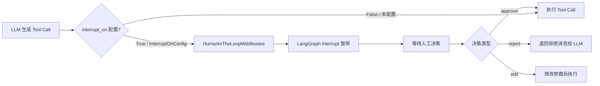
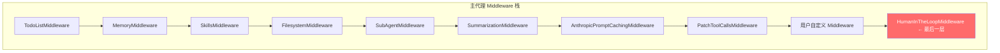
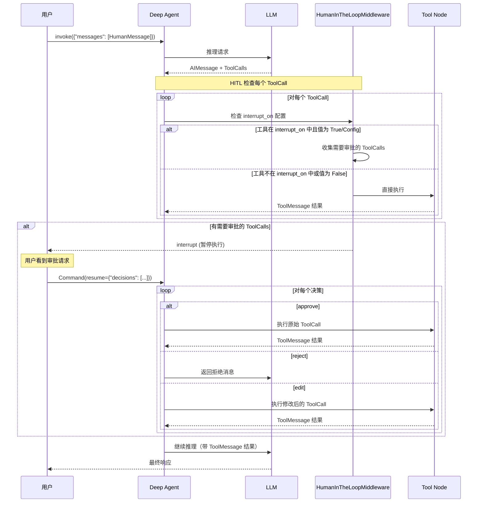
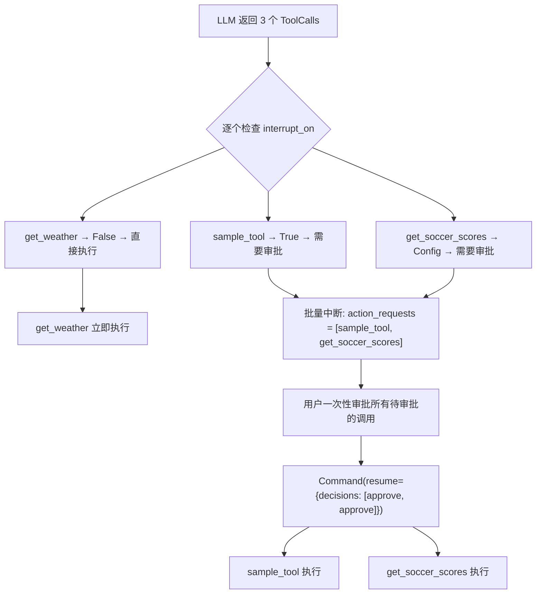
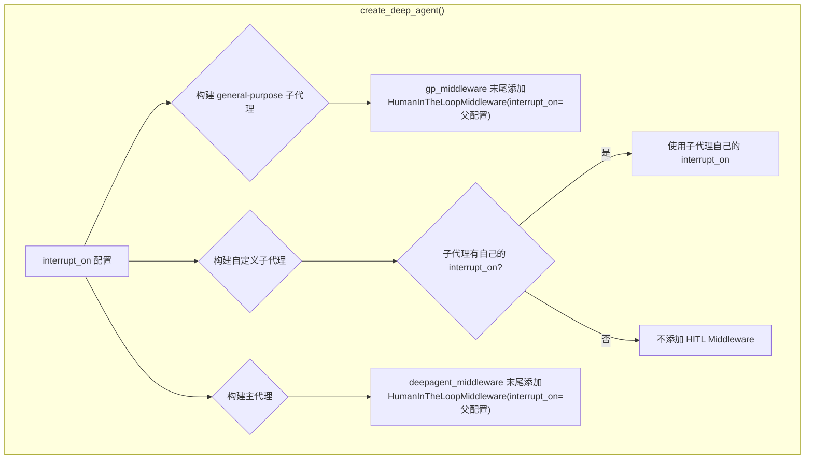
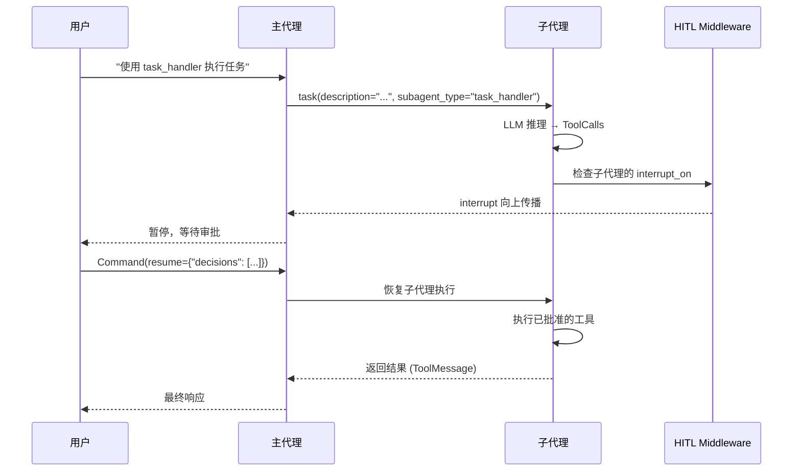
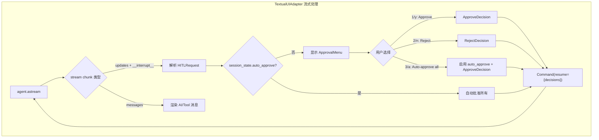
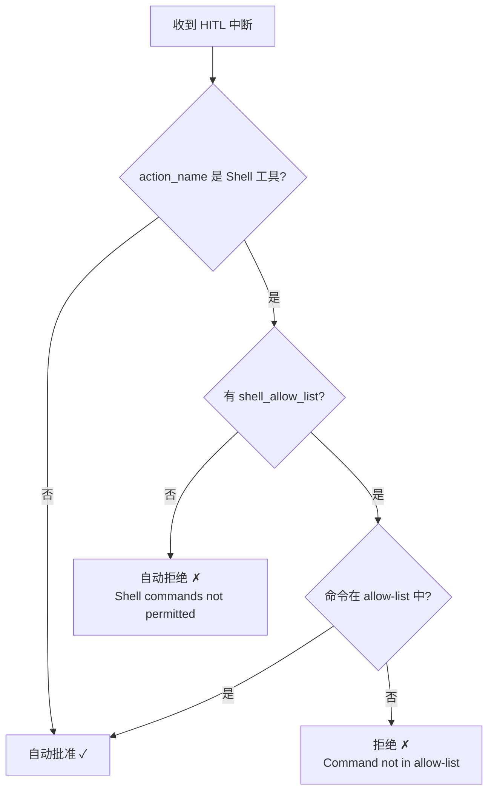

---
layout: post
date: 2026-02-26
title: Deep Agents HITL 
categories: tech_coding
tags:
  - machine_learning
  - LLM
  - AIAgent
  - DeepAgents
---


## 概述

Deep Agents 的 Human-in-the-Loop (HITL) 机制允许在 Agent 执行工具调用之前暂停执行，等待人工审批。这是一个关键的安全机制，特别是在涉及文件写入、Shell 命令执行、网络请求等具有副作用的操作时。

HITL 的核心实现依赖于：
1. **`HumanInTheLoopMiddleware`** — 来自 `langchain.agents.middleware`，作为 Middleware 栈的最后一层
2. **LangGraph `interrupt` / `Command(resume=...)` 机制** — 底层的暂停/恢复原语
3. **`InterruptOnConfig`** — 每个工具的中断配置（允许的决策类型、描述等）



## 核心数据模型

### `interrupt_on` 配置

`interrupt_on` 是一个字典，映射工具名称到中断配置：

```python
interrupt_on: dict[str, bool | InterruptOnConfig] | None
```

配置方式有三种：

| 配置值 | 含义 | 默认 `allowed_decisions` |
|--------|------|------------------------|
| `True` | 启用中断，使用默认配置 | `["approve", "edit", "reject"]` |
| `False` | 显式禁用该工具的中断 | — |
| `InterruptOnConfig` | 精细控制 | 自定义 |

### `InterruptOnConfig`

```python
class InterruptOnConfig(TypedDict):
    allowed_decisions: list[str]  # "approve", "edit", "reject" 的子集
    description: str | Callable   # 中断时显示的描述信息
```

### 配置示例

```python
# 示例 1: 简单布尔配置
interrupt_on = {
    "sample_tool": True,       # 启用，默认 approve/edit/reject
    "get_weather": False,      # 禁用，自动执行
    "get_soccer_scores": {"allowed_decisions": ["approve", "reject"]},  # 只允许批准或拒绝，不允许编辑
}

# 示例 2: CLI 中的完整配置（带描述回调）
interrupt_on = {
    "execute": {
        "allowed_decisions": ["approve", "reject"],
        "description": _format_execute_description,
    },
    "write_file": {
        "allowed_decisions": ["approve", "reject"],
        "description": _format_write_file_description,
    },
    "edit_file": {
        "allowed_decisions": ["approve", "reject"],
        "description": _format_edit_file_description,
    },
    "web_search": {
        "allowed_decisions": ["approve", "reject"],
        "description": _format_web_search_description,
    },
    "fetch_url": {
        "allowed_decisions": ["approve", "reject"],
        "description": _format_fetch_url_description,
    },
    "task": {
        "allowed_decisions": ["approve", "reject"],
        "description": _format_task_description,
    },
}
```

### 中断值结构 (Interrupt Value)

当 HITL 中断发生时，LangGraph 的 `state.interrupts` 包含以下结构：

```python
# state.interrupts[0].value 的结构
{
    "action_requests": [
        {
            "name": "execute",           # 工具名称
            "args": {"command": "ls -la"} # 工具参数
        },
        {
            "name": "write_file",
            "args": {"file_path": "/tmp/test.py", "content": "..."}
        }
    ],
    "review_configs": [
        {
            "action_name": "execute",
            "allowed_decisions": ["approve", "reject"]
        },
        {
            "action_name": "write_file",
            "allowed_decisions": ["approve", "edit", "reject"]
        }
    ]
}
```

### 恢复决策结构 (Resume Decisions)

```python
# 恢复时传入的决策
Command(resume={
    "decisions": [
        {"type": "approve"},                          # 批准
        {"type": "reject"},                           # 拒绝
        {"type": "reject", "message": "不允许执行"},   # 带消息的拒绝
        {"type": "edit", "args": {"command": "ls"}},  # 编辑参数后批准
    ]
})

# 多个 interrupt 时，按 interrupt_id 分组
Command(resume={
    "<interrupt_id_1>": {"decisions": [{"type": "approve"}]},
    "<interrupt_id_2>": {"decisions": [{"type": "reject"}]},
})
```

## Middleware 栈中的位置

`HumanInTheLoopMiddleware` 始终是 Middleware 栈的**最后一层**。这意味着它在所有其他 Middleware 处理完毕后才介入，确保拦截的是最终要执行的工具调用。



### 为什么是最后一层？

在 `create_deep_agent()` 中，HITL Middleware 的添加逻辑如下：

```python
# graph.py 中的关键代码
deepagent_middleware: list[AgentMiddleware] = [
    TodoListMiddleware(),
    MemoryMiddleware(...),
    SkillsMiddleware(...),
    FilesystemMiddleware(backend=backend),
    SubAgentMiddleware(backend=backend, subagents=all_subagents),
    SummarizationMiddleware(...),
    AnthropicPromptCachingMiddleware(...),
    PatchToolCallsMiddleware(),
]

# 用户自定义 middleware 在 HITL 之前
if middleware:
    deepagent_middleware.extend(middleware)

# HITL 始终最后添加
if interrupt_on is not None:
    deepagent_middleware.append(HumanInTheLoopMiddleware(interrupt_on=interrupt_on))
```

这个顺序保证了：
1. 所有工具注册（FilesystemMiddleware、SubAgentMiddleware 等）已完成
2. 所有 Prompt 修改（MemoryMiddleware、SkillsMiddleware 等）已应用
3. HITL 拦截的是完整的、最终的工具调用列表

## 完整执行流程

### 基本流程



### 并行工具调用的处理

当 LLM 在一次响应中发出多个工具调用时，HITL 会将需要审批的调用**批量收集**，一次性呈现给用户：



关键点：
- **未配置中断的工具**（如 `get_weather: False`）会**立即执行**，不等待审批
- **需要审批的工具**会被**批量收集**到一个 interrupt 中
- 用户的决策数量必须与 `action_requests` 数量一致

## 子代理 (SubAgent) 中的 HITL

### 配置继承

HITL 配置在子代理中有两种模式：

#### 1. 继承父代理配置

当子代理没有指定自己的 `interrupt_on` 时，使用父代理的配置：

```python
agent = create_deep_agent(
    model=model,
    tools=[sample_tool, get_weather, get_soccer_scores],
    interrupt_on={
        "sample_tool": True,
        "get_weather": False,
        "get_soccer_scores": {"allowed_decisions": ["approve", "reject"]},
    },
    checkpointer=checkpointer,
)
# general-purpose 子代理自动继承上述 interrupt_on 配置
```

#### 2. 子代理自定义配置

子代理可以覆盖父代理的 HITL 配置：

```python
agent = create_deep_agent(
    model=model,
    tools=[sample_tool, get_weather, get_soccer_scores],
    interrupt_on={
        "sample_tool": True,
        "get_weather": False,
        "get_soccer_scores": {"allowed_decisions": ["approve", "reject"]},
    },
    checkpointer=checkpointer,
    subagents=[
        {
            "name": "task_handler",
            "description": "A subagent that can handle all sorts of tasks",
            "system_prompt": "You are a task handler.",
            "tools": [sample_tool, get_weather, get_soccer_scores],
            # 子代理自定义：sample_tool 不需要审批，get_weather 需要审批
            "interrupt_on": {
                "sample_tool": False,
                "get_weather": True,
                "get_soccer_scores": True,
            },
        },
    ],
)
```

### 子代理 HITL 的内部实现



在 `graph.py` 中的具体实现：

```python
# General-purpose 子代理的 middleware 构建
gp_middleware = [
    TodoListMiddleware(),
    FilesystemMiddleware(backend=backend),
    SummarizationMiddleware(...),
    AnthropicPromptCachingMiddleware(...),
    PatchToolCallsMiddleware(),
]
if interrupt_on is not None:
    gp_middleware.append(HumanInTheLoopMiddleware(interrupt_on=interrupt_on))

# 自定义子代理在 SubAgentMiddleware._get_subagents() 中处理
# subagents.py 中的逻辑：
interrupt_on = spec.get("interrupt_on")
if interrupt_on:
    middleware.append(HumanInTheLoopMiddleware(interrupt_on=interrupt_on))
```

### 子代理中断的传播

子代理的中断会**向上传播**到父代理的 LangGraph 图中。由于 `subgraphs=True` 的流式配置，父代理可以捕获子代理的中断事件：



## CLI 中的 HITL 实现

Deep Agents CLI (`deepagents-cli`) 提供了两种 HITL 交互模式：交互式 (Textual TUI) 和非交互式。

### 交互式模式 (Textual TUI)

在交互式模式下，CLI 使用 Textual 框架渲染审批对话框：



#### ApprovalMenu 组件

`ApprovalMenu` 是一个 Textual `Container` 组件，提供以下功能：

| 快捷键 | 操作 |
|--------|------|
| `1` / `y` / `Enter`(选中 Approve) | 批准所有待审批的工具调用 |
| `2` / `n` / `Enter`(选中 Reject) | 拒绝所有待审批的工具调用 |
| `3` / `a` / `Enter`(选中 Auto-approve) | 启用自动批准（本次会话内所有后续调用自动批准） |
| `e` | 展开/折叠 Shell 命令详情 |
| `↑` / `k` | 向上移动选择 |
| `↓` / `j` | 向下移动选择 |

#### 工具特定的审批预览

CLI 为不同工具类型提供了专门的审批预览组件：

| 工具 | 预览组件 | 显示内容 |
|------|---------|---------|
| `write_file` | `WriteFileApprovalWidget` | 文件路径 + 语法高亮的文件内容 |
| `edit_file` | `EditFileApprovalWidget` | 文件路径 + 彩色 diff 对比 |
| `execute` | Shell 命令显示 | 命令文本（可展开/折叠） |
| 其他工具 | `GenericApprovalWidget` | 参数键值对列表 |

#### 自动批准 (Auto-Approve)

当用户在审批菜单中选择 "Auto-approve all" 后：
1. `session_state.auto_approve` 设为 `True`
2. 状态栏更新显示自动批准已启用
3. 后续所有中断自动以 `ApproveDecision` 响应
4. 此设置仅在当前会话内有效

### 非交互式模式

非交互式模式 (`deepagents -n "task"`) 使用基于规则的自动决策：



#### 非交互式 HITL 决策逻辑

```python
def _make_hitl_decision(action_request, console):
    action_name = action_request.get("name", "")

    if action_name in SHELL_TOOL_NAMES:
        if not settings.shell_allow_list:
            return {"type": "reject", "message": "Shell commands not permitted..."}

        command = action_request.get("args", {}).get("command", "")
        if is_shell_command_allowed(command, settings.shell_allow_list):
            return {"type": "approve"}
        else:
            return {"type": "reject", "message": f"Command '{command}' not in allow-list..."}

    # 非 Shell 工具自动批准
    return {"type": "approve"}
```

关键规则：
- **无 `--shell-allow-list`**：Shell 禁用，其他工具全部自动批准
- **有 `--shell-allow-list`**：Shell 启用但受限，命令必须在白名单中
- 支持管道命令检查（`ls | grep` 中的每个命令都必须在白名单中）
- 命令替换（`$(whoami)`）会被拒绝

#### 迭代限制

非交互式模式有一个安全上限 `_MAX_HITL_ITERATIONS = 50`，防止 Agent 陷入无限重试循环（例如反复尝试被拒绝的命令）。

## CLI 中被拦截的工具

在 CLI 的默认配置中（`auto_approve=False`），以下工具会触发 HITL 审批：

| 工具名称 | 说明 | `allowed_decisions` |
|----------|------|-------------------|
| `execute` | Shell 命令执行 | `["approve", "reject"]` |
| `write_file` | 写入文件 | `["approve", "reject"]` |
| `edit_file` | 编辑文件 | `["approve", "reject"]` |
| `web_search` | 网络搜索 | `["approve", "reject"]` |
| `fetch_url` | 获取 URL 内容 | `["approve", "reject"]` |
| `task` | 启动子代理 | `["approve", "reject"]` |

以下工具**不会**触发 HITL（只读操作）：
- `ls` — 列出目录
- `read_file` — 读取文件
- `glob` — 文件模式匹配
- `grep` — 文件内容搜索
- `write_todos` — 管理待办列表

## Checkpointer 依赖

HITL 机制**必须**配合 LangGraph Checkpointer 使用。Checkpointer 负责：

1. **持久化中断状态** — 当 `interrupt` 发生时，Agent 的完整状态（消息历史、待执行的工具调用等）被保存
2. **恢复执行** — 当 `Command(resume=...)` 到达时，从保存的状态恢复执行
3. **线程隔离** — 通过 `thread_id` 确保不同对话的中断状态互不干扰

```python
from langgraph.checkpoint.memory import MemorySaver

# 必须提供 checkpointer
agent = create_deep_agent(
    model="claude-sonnet-4-5-20250929",
    tools=[...],
    interrupt_on={"execute": True, "write_file": True},
    checkpointer=MemorySaver(),  # 必需！
)

# 使用 thread_id 标识对话
config = {"configurable": {"thread_id": "my-thread-123"}}

# 第一次调用 — 可能触发中断
result = agent.invoke({"messages": [HumanMessage("写一个 hello.py")]}, config)

# 检查中断状态
state = agent.get_state(config)
if state.interrupts:
    # 恢复执行
    result = agent.invoke(
        Command(resume={"decisions": [{"type": "approve"}]}),
        config
    )
```

## 安全建议

### 何时启用 HITL

| 场景 | 建议 |
|------|------|
| 使用 `FilesystemBackend`（直接访问本地文件系统） | **强烈建议**启用 HITL |
| 使用 `LocalShellBackend`（执行 Shell 命令） | **必须**启用 HITL |
| 使用 `StateBackend`（内存中操作） | 可选 |
| 使用 `BaseSandbox`（沙箱环境） | 可选，但建议对敏感操作启用 |
| 生产环境 | 根据信任级别决定 |

### 最佳实践

1. **最小权限原则** — 只对需要的工具启用中断，避免过度审批导致用户疲劳
2. **Shell 命令始终审批** — `execute` 工具可以绕过文件系统限制，应始终启用 HITL
3. **非交互式使用白名单** — 在 CI/CD 等非交互式场景中，使用 `--shell-allow-list` 限制允许的命令
4. **子代理配置** — 子代理可以有更宽松或更严格的 HITL 配置，根据其职责调整

## 完整端到端示例

```python
from deepagents import create_deep_agent
from langgraph.checkpoint.memory import MemorySaver
from langgraph.types import Command

# 创建带 HITL 的 Agent
agent = create_deep_agent(
    model="claude-sonnet-4-5-20250929",
    interrupt_on={
        "execute": True,                                    # Shell 命令需要审批
        "write_file": True,                                 # 文件写入需要审批
        "edit_file": {"allowed_decisions": ["approve", "reject"]},  # 文件编辑只能批准或拒绝
        "read_file": False,                                 # 文件读取不需要审批
    },
    checkpointer=MemorySaver(),
)

thread_id = "example-thread"
config = {"configurable": {"thread_id": thread_id}}

# 第一次调用
result = agent.invoke(
    {"messages": [{"role": "user", "content": "创建一个 Python 项目结构"}]},
    config,
)

# 检查是否有中断
state = agent.get_state(config)
while state.interrupts:
    interrupt_value = state.interrupts[0].value
    action_requests = interrupt_value["action_requests"]
    review_configs = interrupt_value["review_configs"]

    # 显示待审批的操作
    for req, cfg in zip(action_requests, review_configs):
        print(f"工具: {req['name']}, 参数: {req['args']}")
        print(f"允许的决策: {cfg['allowed_decisions']}")

    # 做出决策（这里全部批准）
    decisions = [{"type": "approve"} for _ in action_requests]
    result = agent.invoke(Command(resume={"decisions": decisions}), config)

    # 再次检查是否有新的中断
    state = agent.get_state(config)

print("执行完成！")
```
