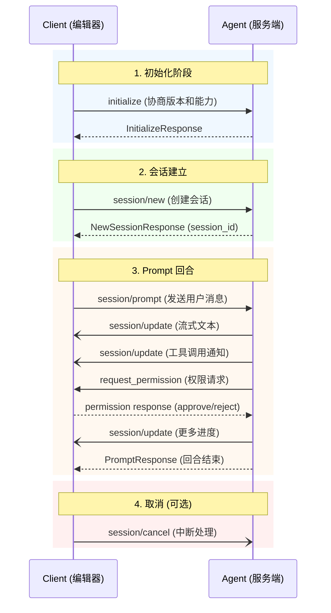
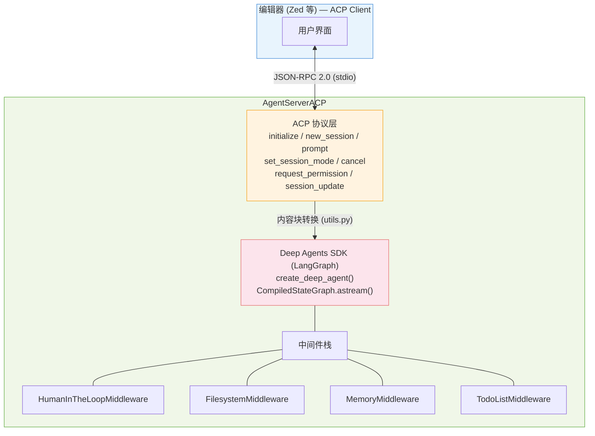
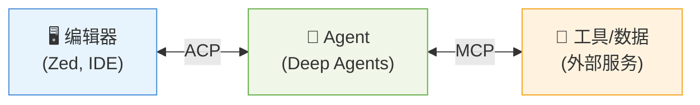

---
layout: post
date: 2026-02-27
title: "Agent Client Protocol (ACP) in Deepagents
categories: tech_coding
tags:
  - DeepAgents
  - AIAgent
  - ACP
  - Zed
  - LangGraph
---

## 什么是 ACP？

Agent Client Protocol (ACP) 是由 [Zed Industries](https://zed.dev/) 发起的开放标准协议，用于标准化代码编辑器/IDE 与 AI 编码 Agent 之间的通信。它的定位类似于 Language Server Protocol (LSP) 之于语言服务器——ACP 将 Agent 与编辑器解耦，使得任何 ACP 兼容的 Agent 可以在任何支持 ACP 的编辑器中运行。

协议官方网站：[agentclientprotocol.com](https://agentclientprotocol.com/)

### 核心价值

- 消除集成开销：不再需要为每个 Agent-编辑器组合做定制开发
- 广泛兼容：Agent 只需实现一次 ACP，即可在所有兼容编辑器中使用
- 开发者自由：用户可以自由选择 Agent 和编辑器的组合

### 通信模型

ACP 基于 JSON-RPC 2.0 规范，支持两种消息类型：

- Methods（方法）：请求-响应对，期望返回结果或错误
- Notifications（通知）：单向消息，不期望响应

支持本地（stdio）和远程（HTTP/WebSocket）两种部署模式。

## ACP 协议生命周期

一个典型的 ACP 会话流程如下：



### Agent 端方法

| 方法 | 说明 |
|------|------|
| `initialize` | 协商协议版本，交换能力声明 |
| `session/new` | 创建新的对话会话 |
| `session/prompt` | 接收用户消息并处理 |
| `session/set_mode` | 切换 Agent 运行模式（可选） |
| `session/cancel` | 取消正在进行的操作（通知） |

### Client 端方法

| 方法 | 说明 |
|------|------|
| `session/request_permission` | 请求用户授权工具调用 |
| `session/update` | 发送会话更新通知（消息、工具调用、计划等） |
| `fs/read_text_file` | 读取文件内容（可选） |
| `fs/write_text_file` | 写入文件内容（可选） |
| `terminal/*` | 终端操作系列（可选） |


## Deep Agents 中的 ACP 架构

在 Deep Agents monorepo 中，ACP 集成位于 `libs/acp/` 包（`deepagents-acp`）。它的核心作用是将 Deep Agents SDK 构建的 LangGraph Agent 桥接到 ACP 协议，使其可以在 Zed 等支持 ACP 的编辑器中运行。

### 包结构

```
libs/acp/
├── deepagents_acp/
│   ├── __init__.py          # 包入口
│   ├── __main__.py          # 模块入口点（python -m deepagents_acp）
│   ├── server.py            # 核心：AgentServerACP 类
│   └── utils.py             # 内容块转换、命令解析等工具函数
├── examples/
│   ├── demo_agent.py        # 完整的 demo Agent（含模式切换、HITL）
│   └── local_context.py     # 本地上下文中间件（检测项目环境）
├── tests/
├── pyproject.toml
└── run_demo_agent.sh        # Zed 启动脚本
```

### 核心类：`AgentServerACP`

`AgentServerACP` 是整个 ACP 集成的核心，它继承自 `acp.Agent`（ACP Python SDK 提供的基类），负责：

1. 实现 ACP 协议的所有生命周期方法
2. 将 ACP 内容块（文本、图片、资源等）转换为 LangChain 格式
3. 流式传输 Agent 响应到客户端
4. 处理 Human-in-the-Loop (HITL) 权限请求
5. 管理会话、计划（Plan）和工具调用状态

```python
class AgentServerACP(ACPAgent):
    """ACP agent server that bridges Deep Agents with the Agent Client Protocol."""

    def __init__(
        self,
        agent: CompiledStateGraph | Callable[[AgentSessionContext], CompiledStateGraph],
        *,
        modes: SessionModeState | None = None,
    ) -> None:
        ...
```

构造函数接受两种形式的 Agent：
- 直接传入一个编译好的 `CompiledStateGraph`（简单场景）
- 传入一个工厂函数 `Callable[[AgentSessionContext], CompiledStateGraph]`（需要根据会话上下文动态创建 Agent）

### 架构层次图



### 关键流程详解

#### 1. 会话创建 (`new_session`)

当编辑器打开一个新的 Agent 线程时，调用 `new_session`，传入工作目录 `cwd` 和可选的 MCP 服务器列表。服务端生成唯一的 `session_id` 并返回。

如果配置了 `modes`（运行模式），会在响应中返回可用模式列表。

#### 2. 消息处理 (`prompt`)

这是最核心的方法。当用户发送消息时：

1. 将 ACP 内容块（`TextContentBlock`、`ImageContentBlock` 等）转换为 LangChain 的多模态内容格式
2. 通过 `agent.astream()` 流式执行 Agent
3. 实时将 Agent 的文本输出、工具调用通过 `session/update` 通知推送给客户端
4. 遇到中断（interrupt）时，通过 `request_permission` 请求用户授权
5. 处理用户的授权决策（approve/reject/approve_always），然后恢复执行

#### 3. Human-in-the-Loop (HITL)

ACP 集成支持精细的权限控制。通过 `interrupt_on` 配置，可以指定哪些工具调用需要用户确认：

```python
interrupt_config = {
    "edit_file": {"allowed_decisions": ["approve", "reject"]},
    "write_file": {"allowed_decisions": ["approve", "reject"]},
    "execute": {"allowed_decisions": ["approve", "reject"]},
}
```

权限请求支持三种决策：
- `approve`：批准本次操作
- `reject`：拒绝本次操作
- `approve_always`：始终批准同类操作（基于命令签名的智能匹配）

#### 4. 运行模式 (`modes`)

Agent 可以定义多种运行模式，用户可以在编辑器中切换：

```python
modes = SessionModeState(
    current_mode_id="accept_edits",
    available_modes=[
        SessionMode(id="ask_before_edits", name="Ask before edits", ...),
        SessionMode(id="accept_edits", name="Accept edits", ...),
        SessionMode(id="accept_everything", name="Accept everything", ...),
    ],
)
```

切换模式时，Agent 会被重置并使用新模式的配置重新创建。

#### 5. 计划管理 (Plan/Todos)

ACP 支持向客户端展示 Agent 的执行计划。当 Agent 调用 `write_todos` 工具时，计划会通过 `AgentPlanUpdate` 推送到编辑器 UI：

```python
# 计划条目包含内容、状态和优先级
PlanEntry(content="实现用户认证", status="in_progress", priority="medium")
```

计划更新有智能的自动批准逻辑——如果已有一个进行中的计划，后续的计划更新会自动批准，无需用户再次确认。


## 如何使用：快速上手

### 前置条件

- Python 3.11+
- [uv](https://docs.astral.sh/uv/) 包管理器
- 一个支持 ACP 的编辑器（目前主要是 [Zed](https://zed.dev/)）
- Anthropic API Key（或其他 LLM 提供商的 Key）

### 安装

```bash
uv add deepagents-acp
```

### 示例 1：最简单的 ACP Agent

这是创建一个 ACP Agent 的最小代码：

```python
import asyncio

from acp import run_agent
from deepagents import create_deep_agent
from langgraph.checkpoint.memory import MemorySaver

from deepagents_acp.server import AgentServerACP


async def main() -> None:
    agent = create_deep_agent(
        # 默认使用 Claude Sonnet，也可以指定其他模型
        checkpointer=MemorySaver(),
    )
    server = AgentServerACP(agent)
    await run_agent(server)


if __name__ == "__main__":
    asyncio.run(main())
```

这个 Agent 会自带 Deep Agents 的内置工具（文件读写、shell 执行等），可以直接在编辑器中进行代码编辑。

### 示例 2：添加自定义工具

```python
import asyncio

from acp import run_agent
from deepagents import create_deep_agent
from langgraph.checkpoint.memory import MemorySaver

from deepagents_acp.server import AgentServerACP


async def get_weather(city: str) -> str:
    """Get weather for a given city."""
    return f"It's always sunny in {city}!"


async def search_docs(query: str) -> str:
    """Search internal documentation."""
    return f"Found 3 results for: {query}"


async def main() -> None:
    agent = create_deep_agent(
        tools=[get_weather, search_docs],
        system_prompt="You are a helpful coding assistant with access to weather and docs.",
        checkpointer=MemorySaver(),
    )
    server = AgentServerACP(agent)
    await run_agent(server)


if __name__ == "__main__":
    asyncio.run(main())
```

### 示例 3：带模式切换和 HITL 的完整 Agent

这是一个更完整的示例，展示了如何配置运行模式和权限控制：

```python
import asyncio

from acp import run_agent
from acp.schema import SessionMode, SessionModeState
from deepagents import create_deep_agent
from deepagents.backends import CompositeBackend, LocalShellBackend, StateBackend
from langgraph.checkpoint.memory import MemorySaver
from langgraph.graph.state import CompiledStateGraph
from langgraph.prebuilt import ToolRuntime

from deepagents_acp.server import AgentServerACP, AgentSessionContext


def get_interrupt_config(mode_id: str) -> dict:
    """根据模式返回不同的权限控制配置。"""
    configs = {
        "supervised": {
            "edit_file": {"allowed_decisions": ["approve", "reject"]},
            "write_file": {"allowed_decisions": ["approve", "reject"]},
            "execute": {"allowed_decisions": ["approve", "reject"]},
            "write_todos": {"allowed_decisions": ["approve", "reject"]},
        },
        "semi_auto": {
            "execute": {"allowed_decisions": ["approve", "reject"]},
            "write_todos": {"allowed_decisions": ["approve", "reject"]},
        },
        "autonomous": {},
    }
    return configs.get(mode_id, {})


async def main() -> None:
    checkpointer = MemorySaver()

    def build_agent(context: AgentSessionContext) -> CompiledStateGraph:
        """根据会话上下文动态创建 Agent。"""
        interrupt_config = get_interrupt_config(context.mode)

        def create_backend(tr: ToolRuntime | None = None) -> CompositeBackend:
            ephemeral = StateBackend(tr) if tr is not None else None
            shell = LocalShellBackend(root_dir=context.cwd, inherit_env=True)
            return CompositeBackend(
                default=shell,
                routes={"/memories/": ephemeral, "/conversation_history/": ephemeral}
                if ephemeral
                else {},
            )

        return create_deep_agent(
            checkpointer=checkpointer,
            backend=create_backend,
            interrupt_on=interrupt_config,
        )

    modes = SessionModeState(
        current_mode_id="semi_auto",
        available_modes=[
            SessionMode(
                id="supervised",
                name="监督模式",
                description="所有文件编辑和命令执行都需要确认",
            ),
            SessionMode(
                id="semi_auto",
                name="半自动模式",
                description="自动执行文件编辑，命令执行需要确认",
            ),
            SessionMode(
                id="autonomous",
                name="自主模式",
                description="所有操作自动执行",
            ),
        ],
    )

    server = AgentServerACP(agent=build_agent, modes=modes)
    await run_agent(server)


if __name__ == "__main__":
    asyncio.run(main())
```

### 在 Zed 中配置

创建好 Agent 脚本后，在 Zed 的 `settings.json` 中添加：

```json
{
  "agent_servers": {
    "MyAgent": {
      "type": "custom",
      "command": "/absolute/path/to/run_agent.sh"
    }
  }
}
```

启动脚本 `run_agent.sh`：

```bash
#!/bin/bash
SCRIPT_DIR="$(dirname "$0")"
uv run --project "$SCRIPT_DIR" python "$SCRIPT_DIR/my_agent.py"
```

也可以使用 [Toad](https://github.com/nichochar/toad) 工具快速启动：

```bash
uv tool install -U batrachian-toad --python 3.14
toad acp "uv run python my_agent.py" .
```

## 工具调用的 UI 展示

`AgentServerACP` 会根据工具类型自动生成合适的 UI 展示：

| 工具名 | UI 展示 | ToolKind |
|--------|---------|----------|
| `read_file` | `Read \`path/to/file\`` | `read` |
| `edit_file` | `Edit \`path/to/file\``（含 diff 预览） | `edit` |
| `write_file` | `Write \`path/to/file\`` | `edit` |
| `execute` | `Execute: \`command\`` | `execute` |
| `ls` / `glob` / `grep` | 搜索类展示 | `search` |
| 其他工具 | 工具名称 | `other` |

对于 `edit_file`，如果提供了 `old_string` 和 `new_string`，会自动生成 diff 内容展示给用户。

## 命令签名与智能权限

当用户选择 "Always allow" 某个命令时，系统会提取命令签名进行匹配，而不是简单地匹配整个命令字符串。这样既安全又方便：

```python
# 命令签名提取示例
"npm install"           → "npm install"
"python -m pytest -q"   → "python -m pytest"
"uv run ruff check ."   → "uv run ruff"
"node -e 'code'"        → "node -e"
"cd dir && npm test"    → ["cd", "npm test"]
```

对于安全敏感的命令（python、node、npm、uv 等），签名会包含子命令以避免过度授权。

## 内容块转换

ACP 定义了多种内容块类型，`deepagents-acp` 的 `utils.py` 负责将它们转换为 LangChain 的多模态格式：

| ACP 内容块 | 转换结果 |
|------------|---------|
| `TextContentBlock` | `{"type": "text", "text": "..."}` |
| `ImageContentBlock` | `{"type": "image_url", "image_url": {"url": "data:...;base64,..."}}` |
| `ResourceContentBlock` | 文本描述（含 URI、描述、MIME 类型） |
| `EmbeddedResourceContentBlock` | 内联文本或 base64 数据 |
| `AudioContentBlock` | 暂不支持（抛出 `NotImplementedError`） |

## 与 MCP 的关系

ACP 和 MCP (Model Context Protocol) 是互补的协议：

- MCP：标准化 LLM 与外部工具/数据源之间的通信（Agent ↔ 工具）
- ACP：标准化编辑器与 AI Agent 之间的通信（编辑器 ↔ Agent）



在 Deep Agents 中，`new_session` 方法接受 `mcp_servers` 参数，允许客户端传入 MCP 服务器配置，Agent 可以利用这些外部工具来增强能力。

## 依赖关系

```
deepagents-acp
├── agent-client-protocol >= 0.8.0   # ACP Python SDK
├── deepagents                        # Deep Agents SDK (LangGraph-based)
└── python-dotenv >= 1.2.1            # 环境变量管理
```

## 参考资料

- [ACP 协议规范](https://agentclientprotocol.com/protocol/overview) - 协议完整定义
- [ACP Python SDK](https://github.com/agentclientprotocol/python-sdk) - Python 实现
- [Deep Agents 文档](https://docs.langchain.com/oss/python/deepagents/overview) - SDK 文档
- [Zed 编辑器](https://zed.dev/) - 目前主要的 ACP 客户端实现
